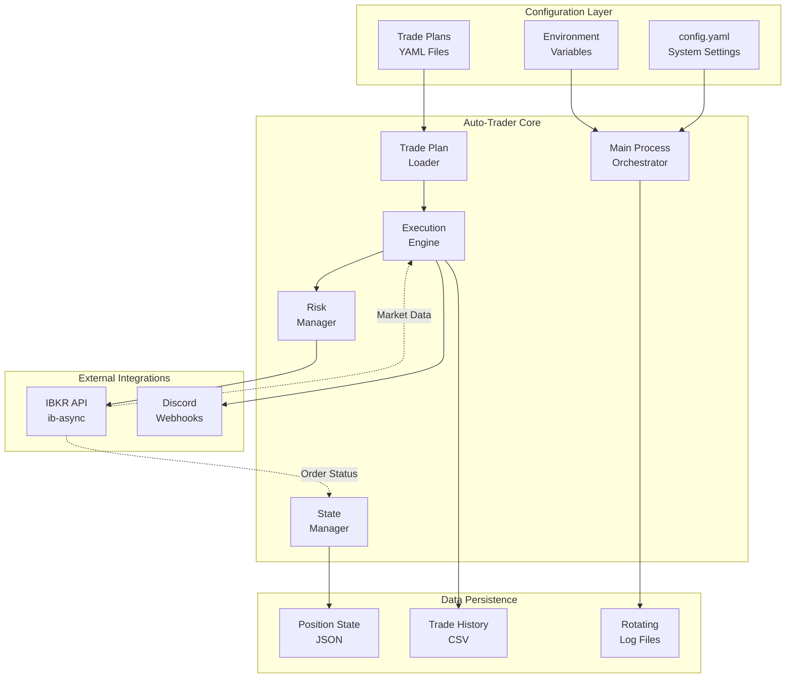
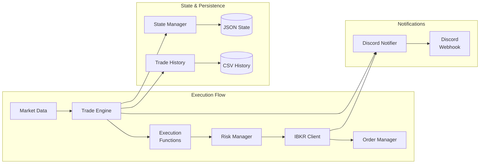
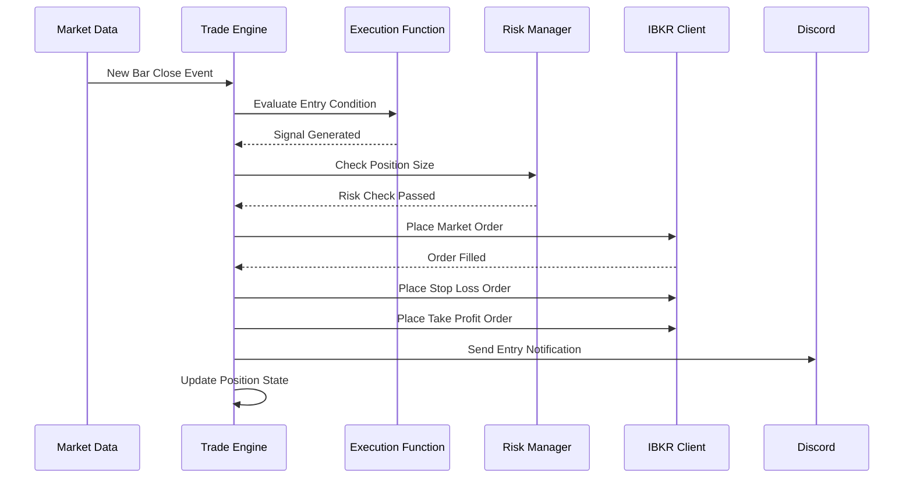
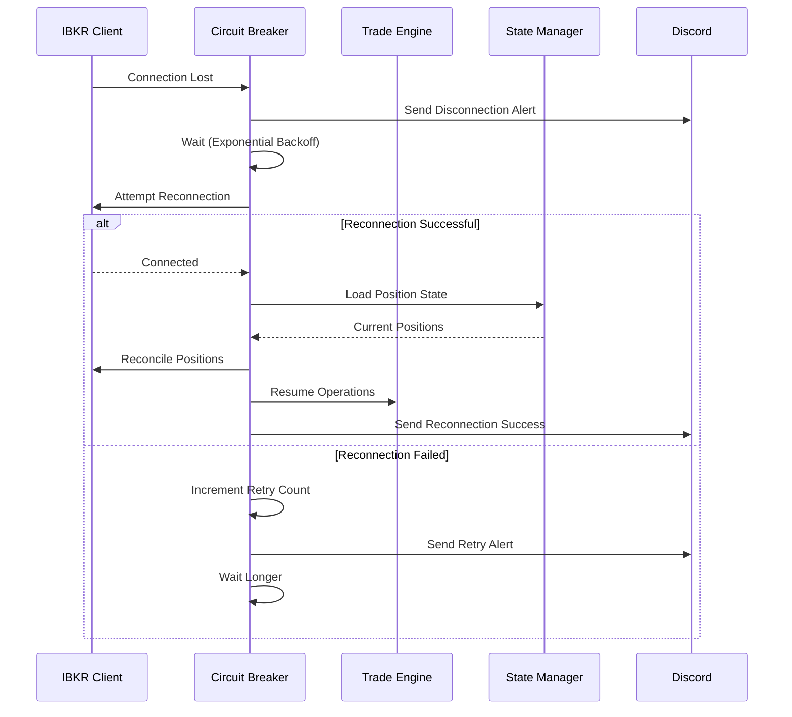

# Auto-Trader Architecture Document

## Introduction

This document outlines the overall project architecture for Auto-Trader, including backend systems, shared services, and non-UI specific concerns. Its primary goal is to serve as the guiding architectural blueprint for AI-driven development, ensuring consistency and adherence to chosen patterns and technologies.

**Relationship to Frontend Architecture:**
If the project includes a significant user interface, a separate Frontend Architecture Document will detail the frontend-specific design and MUST be used in conjunction with this document. Core technology stack choices documented herein (see "Tech Stack") are definitive for the entire project, including any frontend components.

### Starter Template or Existing Project

N/A - This is a greenfield project built from scratch without using any starter templates, following KISS and YAGNI principles.

### Change Log
| Date | Version | Description | Author |
|------|---------|-------------|--------|
| 2025-08-03 | 1.0 | Initial architecture based on PRD | Winston (Architect) |

## High Level Architecture

### Technical Summary

Auto-Trader is a monolithic Python application designed for automated trade execution with time-based triggers. The system connects to Interactive Brokers for market data and trade execution, implements risk management checks, and provides observability through Discord notifications. Built following KISS and YAGNI principles, it uses established libraries (ib-async, pandas, pydantic) to minimize custom code and focuses on reliability over complexity.

### High Level Overview

**Architectural Style:** Monolithic application with modular components
- Single Python process managing all functionality  
- Clear module separation following vertical slice architecture
- Shared in-memory state for sub-second execution latency
- File-based persistence for configuration and state

**Repository Structure:** Monorepo (as defined in PRD)
- All components in single repository for simplified deployment
- Vertical slice organization with tests next to code
- Maximum 500 lines per file, functions under 50 lines

**Service Architecture:** Event-driven monolith
- Async event loops for market data processing
- Time-based triggers using APScheduler
- In-memory state management for low latency
- File-based persistence for durability

**Primary Data Flow:**
1. Trade plans loaded from YAML files at startup
2. Market data streamed from IBKR WebSocket
3. Execution functions evaluate on candle close events
4. Risk checks performed before order placement
5. Orders submitted to IBKR, notifications sent to Discord
6. Trade history appended to CSV, state persisted to JSON

### High Level Project Diagram



### Architectural and Design Patterns

- **Event-Driven Architecture:** Market data events trigger execution logic - _Rationale:_ Natural fit for real-time trading systems, enables responsive execution
- **Repository Pattern:** Abstract data access for trade plans and state - _Rationale:_ Simplifies testing and future migration to database if needed
- **Strategy Pattern:** Pluggable execution functions (close_above, close_below, trailing_stop) - _Rationale:_ Enables easy addition of new execution logic without modifying core engine
- **Observer Pattern:** WebSocket market data subscriptions with callbacks - _Rationale:_ Decouples data reception from processing logic
- **Circuit Breaker Pattern:** Connection management with automatic reconnection - _Rationale:_ Ensures resilience to network issues
- **Dependency Injection:** Configuration and dependencies passed to constructors - _Rationale:_ Improves testability and follows SOLID principles

## Tech Stack

This is the DEFINITIVE technology selection for the project. All components MUST use these exact versions and libraries.

### Cloud Infrastructure
- **Provider:** N/A - Local deployment only for MVP
- **Key Services:** Local file system for persistence
- **Deployment Regions:** User's local machine (Windows/Linux)

### Technology Stack Table

| Category | Technology | Version | Purpose | Rationale |
|----------|------------|---------|---------|-----------|
| **Language** | Python | 3.11.8 | Primary development language | Modern features, excellent async support, financial ecosystem |
| **Package Manager** | UV | 0.5.0+ | Fast dependency management | Blazing fast, replaces pip/poetry/virtualenv |
| **Async Runtime** | asyncio | stdlib | Concurrent I/O operations | Built-in, mature, perfect for event-driven systems |
| **IBKR Integration** | ib-async | 1.0.0+ | Interactive Brokers API | Modern async wrapper, cleaner than ib_insync |
| **Market Data** | fmp-sdk | 1.0.0+ | Financial Modeling Prep API | Official SDK, well-maintained |
| **Data Processing** | pandas | 2.2.0 | Time series manipulation | Industry standard for financial data |
| **Data Validation** | pydantic | 2.9.0 | Settings and model validation | Type safety, automatic validation |
| **Numerical** | numpy | 1.26.0 | Numerical computations | Required by pandas, efficient arrays |
| **Scheduling** | APScheduler | 3.10.4 | Time-based event scheduling | Reliable, supports async, perfect for candle events |
| **HTTP Client** | httpx | 0.27.0 | Discord webhooks | Modern async HTTP, replaces requests |
| **Logging** | loguru | 0.7.2 | Structured logging | Superior to stdlib logging, rotation built-in |
| **Configuration** | pydantic-settings | 2.4.0 | Environment config | Type-safe settings with .env support |
| **Testing** | pytest | 8.3.0 | Test framework | De facto Python standard |
| **Testing - Async** | pytest-asyncio | 0.24.0 | Async test support | Required for async code testing |
| **Linting** | ruff | 0.7.0 | Fast Python linter | Replaces flake8/isort/black, blazing fast |
| **Type Checking** | mypy | 1.11.0 | Static type checking | Catches errors before runtime |
| **Time Zones** | pytz | 2024.1 | Timezone handling | Market hours calculations |

## Data Models

### TradePlan
**Purpose:** Represents a complete trading strategy for a single symbol including entry/exit logic

**Key Attributes:**
- plan_id: str - Unique identifier for the plan
- symbol: str - Trading symbol (e.g., "AAPL")
- entry_level: Decimal - Price level for entry
- stop_loss: Decimal - Stop loss price
- take_profit: Decimal - Target price
- position_size: int - Number of shares/contracts
- entry_function: ExecutionFunction - Entry trigger logic
- exit_function: ExecutionFunction - Exit trigger logic
- status: TradePlanStatus - Current state (awaiting_entry, position_open, completed)

**Relationships:**
- Contains ExecutionFunction configurations
- Tracked by Position when active
- Generates TradeHistory records

### ExecutionFunction
**Purpose:** Configuration for time-based execution logic

**Key Attributes:**
- function_type: str - Type identifier (close_above, close_below, trailing_stop)
- timeframe: str - Candle size (1min, 5min, 15min, etc.)
- parameters: dict - Function-specific parameters
- last_evaluated: datetime - Last evaluation timestamp

**Relationships:**
- Embedded in TradePlan for entry/exit logic
- Evaluated by ExecutionEngine

### Position
**Purpose:** Represents an active trading position

**Key Attributes:**
- position_id: str - Unique identifier
- symbol: str - Trading symbol
- entry_price: Decimal - Actual fill price
- quantity: int - Filled quantity
- entry_time: datetime - Position open timestamp
- stop_order_id: str - IBKR stop order ID
- target_order_id: str - IBKR target order ID
- pnl: Decimal - Current P&L

**Relationships:**
- References original TradePlan
- Tracked in PositionState for persistence

### TradeHistory
**Purpose:** Immutable record of completed trades

**Key Attributes:**
- trade_id: str - Unique identifier
- symbol: str - Trading symbol
- side: str - BUY/SELL
- entry_price: Decimal - Entry fill price
- exit_price: Decimal - Exit fill price
- quantity: int - Trade size
- pnl: Decimal - Realized P&L
- fees: Decimal - Transaction costs
- entry_time: datetime - Entry timestamp
- exit_time: datetime - Exit timestamp
- exit_reason: str - stop_loss/take_profit/manual

**Relationships:**
- Generated from completed Positions
- Appended to CSV history file

## Components

### trade_engine
**Responsibility:** Core orchestration of trade execution logic, managing the lifecycle of trade plans from signal generation to order placement

**Key Interfaces:**
- `async def start()` - Initialize engine and start processing
- `async def stop()` - Graceful shutdown
- `async def evaluate_trade_plans()` - Check all plans for signals
- `async def on_market_data(data: MarketData)` - Handle incoming price data

**Dependencies:** risk_manager, ibkr_client, state_manager, execution_functions

**Technology Stack:** Pure Python with asyncio, APScheduler for time-based events

### ibkr_client  
**Responsibility:** Manage all interactions with Interactive Brokers including connection management, market data subscriptions, and order execution

**Key Interfaces:**
- `async def connect()` - Establish IBKR connection
- `async def subscribe_market_data(symbols: List[str])` - Subscribe to real-time bars
- `async def place_order(order: Order) -> str` - Submit order to IBKR
- `async def modify_order(order_id: str, new_params: dict)` - Modify existing order

**Dependencies:** ib-async library, internal circuit breaker for reconnection

**Technology Stack:** ib-async for API wrapper, asyncio for event handling

### risk_manager
**Responsibility:** Enforce position sizing rules, daily loss limits, and pre-trade risk checks to protect capital

**Key Interfaces:**
- `def check_position_size(symbol: str, quantity: int) -> RiskCheck`
- `def check_daily_loss_limit() -> RiskCheck`
- `def check_max_positions() -> RiskCheck`
- `def update_daily_pnl(pnl: Decimal)` - Track realized P&L

**Dependencies:** config.yaml for risk parameters, state_manager for current positions

**Technology Stack:** Pure Python with pydantic for validation

### discord_notifier
**Responsibility:** Send formatted trade notifications and system alerts to Discord webhooks

**Key Interfaces:**
- `async def send_trade_entry(trade: TradeEntry)` - Notify position opened
- `async def send_trade_exit(trade: TradeExit)` - Notify position closed with P&L
- `async def send_error(error: SystemError)` - Alert on system issues
- `async def send_daily_summary(summary: DailySummary)` - End of day report

**Dependencies:** httpx for async HTTP requests

**Technology Stack:** httpx for webhooks, pydantic models for message formatting

### state_manager
**Responsibility:** Persist and recover position state across system restarts, maintaining consistency between in-memory and file state

**Key Interfaces:**
- `def save_position_state(positions: List[Position])` - Persist to JSON
- `def load_position_state() -> List[Position]` - Recover on startup
- `def backup_state()` - Create versioned backups
- `def reconcile_with_broker(broker_positions: List)` - Verify consistency

**Dependencies:** File system for JSON storage

**Technology Stack:** Python json module, pydantic for serialization

### Component Diagrams



## Core Workflows

### Trade Entry Workflow


### Connection Recovery Workflow


## Database Schema

Since we're using file-based storage for MVP, here are the file schemas:

### Trade Plan Schema (YAML)
```yaml
# trade_plans/active_plans.yaml
plans:
  - plan_id: "AAPL_20250803_001"
    symbol: "AAPL"
    entry_level: 180.50
    stop_loss: 178.00
    take_profit: 185.00
    position_size: 100
    entry_function:
      type: "close_above"
      timeframe: "15min"
      parameters:
        threshold: 180.50
    exit_function:
      type: "trailing_stop"
      timeframe: "5min"
      parameters:
        trail_percent: 1.5
    status: "awaiting_entry"
```

### Position State Schema (JSON)
```json
{
  "positions": [
    {
      "position_id": "pos_20250803_142532",
      "symbol": "AAPL",
      "plan_id": "AAPL_20250803_001",
      "entry_price": 180.75,
      "quantity": 100,
      "entry_time": "2025-08-03T14:25:32Z",
      "stop_order_id": "ord_12345",
      "target_order_id": "ord_12346",
      "current_pnl": 125.00
    }
  ],
  "last_updated": "2025-08-03T15:30:00Z",
  "version": 1
}
```

### Trade History Schema (CSV)
```csv
timestamp,trade_id,symbol,side,entry_price,exit_price,quantity,pnl,fees,entry_time,exit_time,exit_reason,function_used,timeframe
2025-08-03T16:45:23Z,trd_001,AAPL,LONG,180.75,183.25,100,250.00,2.00,2025-08-03T14:25:32Z,2025-08-03T16:45:23Z,take_profit,close_above,15min
```

## Source Tree

```plaintext
auto-trader/
├── src/
│   ├── __init__.py
│   ├── main.py                    # Entry point, max 100 lines
│   ├── config.py                  # Settings with pydantic
│   └── auto_trader/
│       ├── __init__.py
│       ├── models/               # Pydantic models
│       │   ├── __init__.py
│       │   ├── trade_plan.py
│       │   ├── position.py
│       │   └── market_data.py
│       ├── trade_engine/         # Core execution logic
│       │   ├── __init__.py
│       │   ├── engine.py
│       │   ├── execution_functions.py
│       │   └── tests/
│       │       ├── test_engine.py
│       │       └── test_execution_functions.py
│       ├── integrations/        # External services
│       │   ├── __init__.py
│       │   ├── ibkr_client/
│       │   │   ├── __init__.py
│       │   │   ├── client.py
│       │   │   ├── circuit_breaker.py
│       │   │   └── tests/
│       │   │       └── test_client.py
│       │   └── discord_notifier/
│       │       ├── __init__.py
│       │       ├── notifier.py
│       │       └── tests/
│       │           └── test_notifier.py
│       ├── risk_management/     # Risk checks
│       │   ├── __init__.py
│       │   ├── risk_manager.py
│       │   └── tests/
│       │       └── test_risk_manager.py
│       └── persistence/         # State management
│           ├── __init__.py
│           ├── state_manager.py
│           ├── trade_history.py
│           └── tests/
│               └── test_state_manager.py
├── data/                       # Runtime data files
│   ├── trade_plans/           # YAML trade plans
│   ├── state/                 # JSON position state
│   └── history/               # CSV trade history
├── logs/                      # Rotating log files
├── scripts/                   # Utility scripts
│   ├── setup_environment.py
│   └── validate_config.py
├── tests/                     # Integration tests
│   ├── conftest.py
│   └── integration/
├── .env.example              # Environment template
├── config.yaml.example       # Config template
├── pyproject.toml           # UV/project config
├── uv.lock                  # Locked dependencies
├── README.md
└── CLAUDE.md                # AI context
```

## Infrastructure and Deployment

### Infrastructure as Code
- **Tool:** Shell scripts + systemd/Task Scheduler
- **Location:** `scripts/deploy/`
- **Approach:** Simple automation scripts for local deployment

### Deployment Strategy
- **Strategy:** Local process deployment with service management
- **CI/CD Platform:** GitHub Actions for testing only (no deployment)
- **Pipeline Configuration:** `.github/workflows/test.yml`

### Environments
- **Development:** Local machine with test IBKR paper account - `.env.development`
- **Production:** Local machine with live IBKR account - `.env.production`

### Environment Promotion Flow
```text
Development (Paper Trading) -> Manual Config Switch -> Production (Live Trading)
```

### Rollback Strategy
- **Primary Method:** Stop service, restore previous version from git
- **Trigger Conditions:** Failed health checks, repeated connection failures
- **Recovery Time Objective:** < 5 minutes

## Error Handling Strategy

### General Approach
- **Error Model:** Fail fast with specific exceptions, recover where possible
- **Exception Hierarchy:** Custom exceptions inherit from AutoTraderError base
- **Error Propagation:** Bubble to main loop, log, notify, continue operation

### Logging Standards
- **Library:** loguru 0.7.2
- **Format:** JSON structured logs with timestamp, level, module, message, context
- **Levels:** DEBUG (dev only), INFO (normal), WARNING (issues), ERROR (failures)
- **Required Context:**
  - Correlation ID: UUID per trade plan evaluation
  - Service Context: module.function name
  - User Context: Not applicable (single user system)

### Error Handling Patterns

#### External API Errors
- **Retry Policy:** Exponential backoff, max 5 attempts
- **Circuit Breaker:** After 5 failures, wait 5 minutes before retry
- **Timeout Configuration:** 30s for HTTP, 60s for IBKR connection
- **Error Translation:** Map IBKR errors to internal exception types

#### Business Logic Errors  
- **Custom Exceptions:** InsufficientFundsError, InvalidTradePlanError, RiskLimitExceeded
- **User-Facing Errors:** Sent to Discord with actionable message
- **Error Codes:** Simple string codes (RISK_001, EXEC_002)

#### Data Consistency
- **Transaction Strategy:** Write-through cache with file persistence
- **Compensation Logic:** Rollback in-memory state on write failure
- **Idempotency:** Order IDs prevent duplicate submissions

## Coding Standards

### Core Standards
- **Languages & Runtimes:** Python 3.11.8 exclusively
- **Style & Linting:** ruff with 100 char line limit, format on save
- **Test Organization:** Tests in `tests/` subdirectory next to code

### Naming Conventions
| Element | Convention | Example |
|---------|------------|---------|
| Variables/Functions | snake_case | `calculate_position_size` |
| Classes | PascalCase | `TradePlan` |
| Constants | UPPER_SNAKE_CASE | `MAX_POSITIONS` |
| Private | _leading_underscore | `_internal_state` |

### Critical Rules
- **Always use pydantic models:** Never pass raw dicts between functions
- **No print statements:** Use logger exclusively for all output
- **Type hints required:** All functions must have complete type annotations
- **UTC everywhere:** All timestamps in UTC, convert at display layer only
- **Decimal for money:** Never use float for prices or monetary values
- **Repository pattern:** All external data access through repository interfaces

## Test Strategy and Standards

### Testing Philosophy
- **Approach:** Test critical paths thoroughly, skip trivial getters/setters
- **Coverage Goals:** 80% for core modules, 100% for risk management
- **Test Pyramid:** 70% unit, 20% integration, 10% end-to-end

### Test Types and Organization

#### Unit Tests
- **Framework:** pytest 8.3.0
- **File Convention:** `test_[module_name].py`
- **Location:** `tests/` subdirectory in each module
- **Mocking Library:** unittest.mock + pytest fixtures
- **Coverage Requirement:** 80% minimum

**AI Agent Requirements:**
- Generate tests for all public methods
- Cover edge cases and error conditions
- Follow AAA pattern (Arrange, Act, Assert)
- Mock all external dependencies

#### Integration Tests
- **Scope:** IBKR connection, file I/O, complete workflows
- **Location:** `tests/integration/`
- **Test Infrastructure:**
  - **IBKR API:** Paper trading account for integration tests
  - **File System:** Temp directories with cleanup
  - **Time:** freezegun for time-dependent tests

### Test Data Management
- **Strategy:** Fixtures for common test data
- **Fixtures:** `tests/conftest.py` for shared fixtures
- **Factories:** pydantic model factories for test objects
- **Cleanup:** Automatic cleanup with pytest fixtures

### Continuous Testing
- **CI Integration:** GitHub Actions on every push
- **Performance Tests:** Not required for MVP
- **Security Tests:** dependency scanning with pip-audit

## Security

### Input Validation
- **Validation Library:** pydantic with strict mode
- **Validation Location:** At system boundaries (file load, API input)
- **Required Rules:**
  - All external inputs MUST be validated
  - Validation at API boundary before processing
  - Whitelist approach preferred over blacklist

### Authentication & Authorization
- **Auth Method:** API keys for external services only
- **Session Management:** Not applicable (no user sessions)
- **Required Patterns:**
  - API keys from environment variables only
  - Never log authentication credentials

### Secrets Management
- **Development:** .env file (git ignored)
- **Production:** Environment variables on host system
- **Code Requirements:**
  - NEVER hardcode secrets
  - Access via pydantic Settings only
  - No secrets in logs or error messages

### API Security
- **Rate Limiting:** Respect IBKR rate limits (50 msg/sec)
- **CORS Policy:** Not applicable (no web interface)
- **Security Headers:** Not applicable (no web interface)
- **HTTPS Enforcement:** All external APIs use HTTPS

### Data Protection
- **Encryption at Rest:** Not required for MVP (local files)
- **Encryption in Transit:** HTTPS for all external communication
- **PII Handling:** No PII stored (single user system)
- **Logging Restrictions:** Never log API keys, positions, or P&L

### Dependency Security
- **Scanning Tool:** pip-audit in CI pipeline
- **Update Policy:** Monthly dependency updates
- **Approval Process:** Test in dev before updating production

### Security Testing
- **SAST Tool:** bandit for Python security issues
- **DAST Tool:** Not applicable (no web interface)
- **Penetration Testing:** Not required for personal use

## Checklist Results Report

### Executive Summary

**Overall Architecture Readiness: HIGH**

The Auto-Trader architecture demonstrates exceptional readiness for implementation with a strong foundation built on KISS and YAGNI principles. This backend-only system (with Discord as UI) shows excellent alignment with requirements and modern development practices.

**Critical Risks Identified:**
1. WebSocket connection stability for real-time market data
2. File-based persistence scalability limitations (acceptable for MVP)
3. Single point of failure with monolithic architecture (mitigated by simplicity)

**Key Strengths:**
- Clear adherence to KISS/YAGNI principles
- Excellent use of established libraries (ib-async, pandas, pydantic)
- Comprehensive error handling and resilience patterns
- Well-structured for AI agent implementation
- Strong security practices for a personal trading system

**Project Type:** Backend-only with CLI/Discord interface (Frontend sections skipped)

### Section Analysis

1. **Requirements Alignment: 95%**
   - All functional requirements mapped to technical solutions
   - Non-functional requirements have specific implementations
   - Minor gap: FMP integration deferred to post-MVP

2. **Architecture Fundamentals: 100%**
   - Crystal clear component separation and responsibilities
   - Excellent use of design patterns (Repository, Strategy, Circuit Breaker)
   - Strong modularity with vertical slice architecture

3. **Technical Stack & Decisions: 98%**
   - Specific versions defined for all technologies
   - Excellent library choices with clear rationales
   - Backend architecture comprehensive and well-designed

4. **Frontend Design: N/A** (Backend-only project)

5. **Resilience & Operational Readiness: 92%**
   - Strong error handling with circuit breaker pattern
   - Comprehensive logging with loguru
   - Simple local deployment appropriate for personal use

6. **Security & Compliance: 90%**
   - Appropriate security for single-user system
   - Good secrets management practices
   - API security addressed through rate limiting

7. **Implementation Guidance: 96%**
   - Excellent coding standards following your principles
   - Clear testing strategy with appropriate coverage goals
   - Strong development environment documentation

8. **Dependency & Integration Management: 94%**
   - All dependencies clearly versioned
   - Good fallback strategies for IBKR connection
   - UV package management well integrated

9. **AI Agent Implementation Suitability: 98%**
   - Exceptional clarity and consistency
   - 500-line file limit ensures manageable components
   - Clear patterns throughout

10. **Accessibility: N/A** (No UI components)

### Risk Assessment

**Top 5 Risks by Severity:**

1. **WebSocket Stability (Medium)**
   - Risk: Market data interruption could miss trade signals
   - Mitigation: Circuit breaker pattern implemented, consider local data caching

2. **File Persistence Limitations (Low)**
   - Risk: Concurrent write issues at scale
   - Mitigation: Acceptable for single-user MVP, clear upgrade path to database

3. **IBKR API Rate Limits (Medium)**
   - Risk: Hitting 50 msg/sec limit during high activity
   - Mitigation: Rate limiting implemented, consider request queuing

4. **Single Process Architecture (Low)**
   - Risk: Process crash loses all state
   - Mitigation: State persistence and recovery implemented

5. **Limited Testing Infrastructure (Low)**
   - Risk: Integration test coverage gaps
   - Mitigation: Paper trading account for testing, focused on critical paths

### Recommendations

**Must-Fix Before Development:**
- None identified - architecture is implementation-ready

**Should-Fix for Better Quality:**
1. Add request queuing for IBKR API calls
2. Implement health check endpoint for monitoring
3. Add backup state validation on recovery

**Nice-to-Have Improvements:**
1. Prometheus metrics for future monitoring
2. Docker containerization for consistent deployment
3. More detailed WebSocket reconnection strategies

### AI Implementation Readiness

**Readiness Score: 98/100**

The architecture is exceptionally well-suited for AI agent implementation:
- Clear file structure with explicit organization
- Consistent patterns throughout (vertical slices, repository pattern)
- Well-defined interfaces between components
- Comprehensive type hints with pydantic models
- No complex or clever code patterns

**Areas Needing Additional Clarification:**
- Specific IBKR connection parameters (host/port)
- Exact Discord webhook format preferences
- Timezone handling for different markets

**Complexity Hotspots:**
- WebSocket event handling (well-documented with ib-async)
- Concurrent trade plan evaluation (simplified with asyncio)

### Backend-Specific Assessment

The backend architecture is comprehensive and production-ready for the MVP scope:
- Clear service boundaries within monolith
- Excellent async patterns for real-time processing
- Strong data persistence strategy
- Well-thought-out error handling
- Appropriate technology choices throughout

The decision to use Discord as the UI interface is brilliant for MVP - it eliminates frontend complexity while providing rich notifications and interaction capabilities.

## Next Steps

Since this is a backend-only system for MVP:

1. **Immediate Development Tasks:**
   - Set up project structure with UV
   - Implement core models with pydantic
   - Create IBKR client with circuit breaker
   - Build execution engine with the three functions
   - Add Discord notifications
   - Implement state persistence

2. **Testing Strategy:**
   - Set up pytest with asyncio support
   - Create integration tests with paper account
   - Build test fixtures for market data

3. **Deployment Preparation:**
   - Create systemd service file (Linux)
   - Create Task Scheduler config (Windows)
   - Write deployment documentation

No frontend architecture needed for MVP - Discord serves as the user interface.