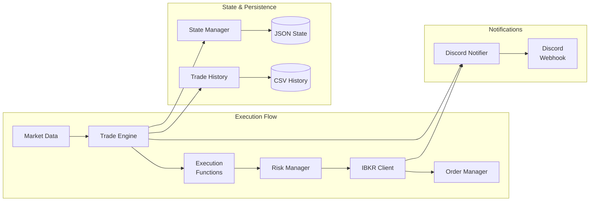

# Components

## Implementation Status

- ✅ **Trade Plan Management** (Stories 1.1, 1.2): Complete YAML-based trade plan system with validation
- ✅ **Interactive CLI Wizard** (Story 1.5.2): Advanced wizard with real-time validation and risk management
- ✅ **Configuration System** (Story 1.1): Comprehensive configuration management with validation  
- ✅ **Modular CLI Interface** (Stories 1.1, 1.2, 1.3, 1.5.2): Enhanced with interactive wizard capabilities
- ✅ **File Monitoring System**: AsyncIO-optimized file watching with improved reliability
- ✅ **Comprehensive Testing**: 200+ tests with 87% coverage including wizard components
- ⏸️ **Trade Engine**: Awaiting implementation (Story 1.4)
- ⏸️ **IBKR Integration**: Awaiting implementation (Story 2.1) 
- ✅ **Risk Management**: Partially implemented (Story 1.5.1) with portfolio tracking and position sizing

---

## ✅ Trade Plan Management System (Implemented)

### TradePlanLoader
**Status:** ✅ Complete (Story 1.2)  
**Responsibility:** Load and manage YAML trade plan files with validation and caching

**Key Interfaces:**
- `load_all_plans(validate: bool = True) -> Dict[str, TradePlan]` - Load all plans from directory
- `load_single_file(file_path: Path) -> List[TradePlan]` - Load plans from specific file
- `get_plan(plan_id: str) -> Optional[TradePlan]` - Retrieve specific plan
- `get_plans_by_status(status: TradePlanStatus) -> List[TradePlan]` - Filter by status
- `update_plan_status(plan_id: str, status: TradePlanStatus)` - Update plan state
- `get_stats() -> Dict[str, Any]` - Get loading statistics

**Features:**
- Directory scanning for YAML files
- File watching with hot-reload capability
- Plan validation on load with error aggregation
- In-memory caching with unique plan ID tracking
- Comprehensive error reporting with line numbers

### ValidationEngine  
**Status:** ✅ Complete (Story 1.2)  
**Responsibility:** Comprehensive YAML validation with detailed error reporting

**Key Interfaces:**
- `validate_yaml_content(content: str, file_path: Optional[Path]) -> ValidationResult`
- `validate_plan_data(plan_data: dict) -> ValidationResult` 
- `validate_file(file_path: Path) -> ValidationResult`
- `add_error_codes(errors: List[ValidationError]) -> List[ValidationError]`

**Validation Rules:**
- Symbol format: 1-10 uppercase characters, no special chars
- Price fields: Positive decimals with max 4 decimal places  
- Risk category: One of "small", "normal", "large"
- Entry level ≠ stop loss (prevent zero-risk trades)
- Plan ID uniqueness across all loaded plans
- Execution function and timeframe validation

### TemplateManager
**Status:** ✅ Complete (Story 1.2)  
**Responsibility:** Manage YAML trade plan templates with inline documentation

**Key Interfaces:**
- `list_available_templates() -> Dict[str, Any]` - Get all templates
- `load_template(template_name: str) -> str` - Load template content
- `get_template_documentation(template_name: str) -> Dict[str, Any]` - Parse inline docs
- `create_plan_from_template(template_name: str, data: dict, output_file: Path) -> TradePlan`
- `validate_template(template_name: str) -> ValidationResult`

**Templates Available:**
- `close_above.yaml` - Execute when price closes above threshold
- `close_below.yaml` - Execute when price closes below threshold  
- `trailing_stop.yaml` - Dynamic trailing stop strategy

## ✅ Interactive CLI Wizard System (Implemented)

### WizardFieldCollector
**Status:** ✅ Complete (Story 1.5.2)  
**Responsibility:** Interactive field collection with real-time validation and risk management integration

**Key Interfaces:**
- `collect_symbol(initial_value: Optional[str]) -> str` - Symbol input with validation
- `collect_entry_level(initial_value: Optional[str]) -> Decimal` - Entry price collection
- `collect_stop_loss(entry_level: Decimal, initial_value: Optional[str]) -> Decimal` - Stop loss with distance calculation
- `collect_risk_category(initial_value: Optional[str]) -> RiskCategory` - Risk level selection
- `calculate_and_display_position_size(entry, stop, risk) -> Tuple[int, Decimal]` - Live position sizing
- `collect_take_profit(initial_value: Optional[str]) -> Decimal` - Target with R:R calculation
- `collect_execution_functions() -> Tuple[ExecutionFunction, ExecutionFunction]` - Function configuration

**Features:**
- **Real-time Validation**: Each field validated immediately using TradePlan model
- **CLI Shortcuts Support**: Pre-populate fields from command-line arguments
- **Portfolio Risk Integration**: Live portfolio status and risk calculations
- **Error Recovery**: Clear error messages with specific correction guidance
- **Progress Indicators**: Visual feedback during field collection process

### TradePlanPreview
**Status:** ✅ Complete (Story 1.5.2)  
**Responsibility:** Rich plan preview with modification support before final save

**Key Interfaces:**
- `show_preview(plan_data: Dict[str, Any]) -> bool` - Display formatted preview
- `_display_plan_preview(plan_data: Dict[str, Any])` - Rich table formatting
- `_handle_modification(plan_data: Dict[str, Any])` - Field modification support

**Features:**
- **Rich Formatting**: Color-coded tables with organized plan details
- **Confirmation Flow**: User options for confirm/modify/cancel
- **Field Modification**: Support for editing values before final save
- **Comprehensive Display**: All plan fields including calculated values

### Risk Management Integration
**Status:** ✅ Complete (Story 1.5.2)  
**Responsibility:** Real-time risk calculations and portfolio limit enforcement

**Key Features:**
- **Portfolio Status Display**: Current risk usage and available capacity at wizard start
- **Real-time Position Sizing**: Live calculations as user enters entry/stop/risk values
- **Portfolio Risk Limit Enforcement**: Hard block at 10% maximum with user override option
- **Risk Breakdown Display**: Individual trade risk + current portfolio risk + new total
- **Adjustment Suggestions**: Clear recommendations when limits are exceeded

**Risk Protection Flow:**
1. Display current portfolio risk at wizard start
2. Calculate position size as fields are entered
3. Check portfolio risk limit (10% maximum)
4. Block plan creation if limit exceeded
5. Provide clear explanation and adjustment suggestions
6. Allow user override with explicit confirmation

### CLI Command Integration
**Status:** ✅ Complete (Story 1.5.2)  
**Responsibility:** Seamless integration with existing CLI architecture

**New Command:**
```bash
auto-trader create-plan [--symbol SYMBOL] [--entry PRICE] [--stop PRICE] [--target PRICE] [--risk CATEGORY] [--output-dir DIR]
```

**CLI Shortcuts:**
- `--symbol`: Pre-populate trading symbol (e.g., AAPL, MSFT)
- `--entry`: Pre-populate entry price level
- `--stop`: Pre-populate stop loss price
- `--target`: Pre-populate take profit target
- `--risk`: Pre-populate risk category (small/normal/large)
- `--output-dir`: Custom output directory for YAML file

**Integration Points:**
- Extends existing `plan_commands.py` with new interactive command
- Uses established CLI patterns and error handling
- Integrates with existing validation engine and models
- Leverages Rich console framework for enhanced UX

### Modular CLI Interface System
**Status:** ✅ Complete (Stories 1.1, 1.2, 1.3) - **Recently Refactored**  
**Responsibility:** Modular command-line interface organized into focused command groups

**Architecture Improvement:**
- **Before:** Single 735-line commands.py file (violated 500-line limit)
- **After:** 7 focused modules (38-266 lines each) maintaining code quality standards

**Command Modules:**
- **config_commands.py** (38 lines): `setup`, `validate-config`
- **plan_commands.py** (397 lines): `validate-plans`, `list-plans`, `create-plan`, `create-plan-interactive`
- **wizard_utils.py** (467 lines): Interactive wizard components and utilities
- **template_commands.py** (80 lines): `list-templates`
- **schema_commands.py** (95 lines): `show-schema`
- **monitor_commands.py** (202 lines): `monitor`, `summary`, `history`
- **diagnostic_commands.py** (151 lines): `doctor`
- **help_commands.py** (89 lines): `help-system`

**Features:**
- Rich console formatting with colors and tables
- Progressive error disclosure (show critical issues first)
- Verbose mode for detailed output
- File permission error handling with context
- Safety defaults (simulation mode enforced)
- **NEW:** Interactive wizard with real-time validation and risk management
- **NEW:** CLI shortcuts support for quick plan creation
- **NEW:** Comprehensive test coverage (90+ CLI tests)
- **NEW:** Modular architecture for better maintainability

### File Monitoring System
**Status:** ✅ Complete with AsyncIO Optimization (Story 1.3)  
**Responsibility:** Optimized file watching with improved performance and reliability

**Key Improvements:**
- **AsyncIO Fix:** Replaced deprecated `asyncio.get_event_loop()` with `asyncio.get_running_loop()`
- **Performance:** Eliminated potential deadlock conditions under high load
- **Reliability:** Enhanced error handling for event loop management
- **Testing:** Comprehensive test coverage for AsyncIO components

**Key Interfaces:**
- `FileWatcher` - Main file monitoring class with AsyncIO optimization
- `TradeplanFileHandler` - Specialized handler for trade plan file events
- `FileWatchEvent` - Event data structure for file system changes
- **NEW:** Proper AsyncIO event loop management patterns

---

## ⏸️ Future Components

## trade_engine
**Responsibility:** Core orchestration of trade execution logic, managing the lifecycle of trade plans from signal generation to order placement

**Key Interfaces:**
- `async def start()` - Initialize engine and start processing
- `async def stop()` - Graceful shutdown
- `async def evaluate_trade_plans()` - Check all plans for signals
- `async def on_market_data(data: MarketData)` - Handle incoming price data

**Dependencies:** risk_manager, ibkr_client, state_manager, execution_functions

**Technology Stack:** Pure Python with asyncio, APScheduler for time-based events

## ibkr_client  
**Responsibility:** Manage all interactions with Interactive Brokers including connection management, market data subscriptions, and order execution

**Key Interfaces:**
- `async def connect()` - Establish IBKR connection
- `async def subscribe_market_data(symbols: List[str])` - Subscribe to real-time bars
- `async def place_order(order: Order) -> str` - Submit order to IBKR
- `async def modify_order(order_id: str, new_params: dict)` - Modify existing order

**Dependencies:** ib-async library, internal circuit breaker for reconnection

**Technology Stack:** ib-async for API wrapper, asyncio for event handling

## risk_manager
**Responsibility:** Automated position sizing, portfolio risk tracking, and comprehensive pre-trade risk validation

**Key Interfaces:**
- `def calculate_position_size(account_balance: Decimal, risk_percent: float, entry_price: Decimal, stop_price: Decimal) -> PositionSizeResult`
- `def check_portfolio_risk_limit(new_trade_risk: Decimal) -> RiskCheck`
- `def get_current_portfolio_risk() -> Decimal` - Calculate total risk percentage
- `def add_position_to_registry(position_id: str, risk_amount: Decimal)` - Track open position risk
- `def remove_position_from_registry(position_id: str)` - Remove closed position risk
- `def validate_trade_plan(trade_plan: TradePlan, account_balance: Decimal) -> RiskValidationResult`
- `def check_daily_loss_limit() -> RiskCheck`

**Risk Categories:**
- Small: 1% account risk per trade
- Normal: 2% account risk per trade  
- Large: 3% account risk per trade

**Portfolio Limits:**
- Maximum 10% total portfolio risk across all open positions
- Position sizing formula: `Position Size = (Account Value × Risk %) ÷ |Entry Price - Stop Loss Price|`

**Dependencies:** config.yaml for risk parameters, state_manager for position registry

**Technology Stack:** Pure Python with pydantic for validation, Decimal for precise calculations

## discord_notifier
**Responsibility:** Send formatted trade notifications and system alerts to Discord webhooks

**Key Interfaces:**
- `async def send_trade_entry(trade: TradeEntry)` - Notify position opened
- `async def send_trade_exit(trade: TradeExit)` - Notify position closed with P&L
- `async def send_error(error: SystemError)` - Alert on system issues
- `async def send_daily_summary(summary: DailySummary)` - End of day report

**Dependencies:** httpx for async HTTP requests

**Technology Stack:** httpx for webhooks, pydantic models for message formatting

## state_manager
**Responsibility:** Persist and recover position state across system restarts, maintaining consistency between in-memory and file state

**Key Interfaces:**
- `def save_position_state(positions: List[Position])` - Persist to JSON
- `def load_position_state() -> List[Position]` - Recover on startup
- `def backup_state()` - Create versioned backups
- `def reconcile_with_broker(broker_positions: List)` - Verify consistency

**Dependencies:** File system for JSON storage

**Technology Stack:** Python json module, pydantic for serialization

## cli_wizard
**Responsibility:** Interactive command-line interface for guided trade plan creation with real-time risk validation

**Key Interfaces:**
- `async def create_trade_plan() -> TradePlan` - Step-by-step plan creation
- `async def create_plan_from_template(template_name: str) -> TradePlan` - Template-based creation
- `def validate_symbol_input(symbol: str) -> ValidationResult` - Real-time symbol validation
- `def calculate_live_risk(entry: Decimal, stop: Decimal, risk_category: str) -> RiskPreview`
- `def show_portfolio_impact(new_risk: Decimal) -> PortfolioSummary`
- `def preview_plan(trade_plan: TradePlan) -> str` - Format plan preview for confirmation

**Features:**
- Progressive field validation with immediate feedback
- Real-time position size calculation during input
- Portfolio risk impact preview
- Error recovery for risk limit violations
- Template system for common strategies
- Quick plan creation with command-line arguments

**Dependencies:** risk_manager for calculations, yaml module for file operations

**Technology Stack:** Pure Python with rich/click for enhanced CLI experience

## Component Diagrams


