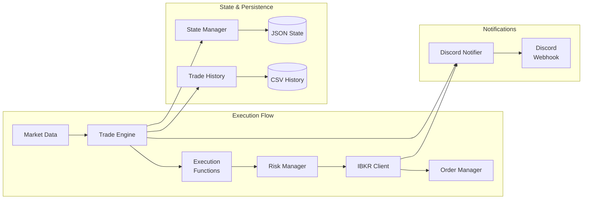

# Components

## trade_engine
**Responsibility:** Core orchestration of trade execution logic, managing the lifecycle of trade plans from signal generation to order placement

**Key Interfaces:**
- `async def start()` - Initialize engine and start processing
- `async def stop()` - Graceful shutdown
- `async def evaluate_trade_plans()` - Check all plans for signals
- `async def on_market_data(data: MarketData)` - Handle incoming price data

**Dependencies:** risk_manager, ibkr_client, state_manager, execution_functions

**Technology Stack:** Pure Python with asyncio, APScheduler for time-based events

## ibkr_client  
**Responsibility:** Manage all interactions with Interactive Brokers including connection management, market data subscriptions, and order execution

**Key Interfaces:**
- `async def connect()` - Establish IBKR connection
- `async def subscribe_market_data(symbols: List[str])` - Subscribe to real-time bars
- `async def place_order(order: Order) -> str` - Submit order to IBKR
- `async def modify_order(order_id: str, new_params: dict)` - Modify existing order

**Dependencies:** ib-async library, internal circuit breaker for reconnection

**Technology Stack:** ib-async for API wrapper, asyncio for event handling

## risk_manager
**Responsibility:** Automated position sizing, portfolio risk tracking, and comprehensive pre-trade risk validation

**Key Interfaces:**
- `def calculate_position_size(account_balance: Decimal, risk_percent: float, entry_price: Decimal, stop_price: Decimal) -> PositionSizeResult`
- `def check_portfolio_risk_limit(new_trade_risk: Decimal) -> RiskCheck`
- `def get_current_portfolio_risk() -> Decimal` - Calculate total risk percentage
- `def add_position_to_registry(position_id: str, risk_amount: Decimal)` - Track open position risk
- `def remove_position_from_registry(position_id: str)` - Remove closed position risk
- `def validate_trade_plan(trade_plan: TradePlan, account_balance: Decimal) -> RiskValidationResult`
- `def check_daily_loss_limit() -> RiskCheck`

**Risk Categories:**
- Small: 1% account risk per trade
- Normal: 2% account risk per trade  
- Large: 3% account risk per trade

**Portfolio Limits:**
- Maximum 10% total portfolio risk across all open positions
- Position sizing formula: `Position Size = (Account Value × Risk %) ÷ |Entry Price - Stop Loss Price|`

**Dependencies:** config.yaml for risk parameters, state_manager for position registry

**Technology Stack:** Pure Python with pydantic for validation, Decimal for precise calculations

## discord_notifier
**Responsibility:** Send formatted trade notifications and system alerts to Discord webhooks

**Key Interfaces:**
- `async def send_trade_entry(trade: TradeEntry)` - Notify position opened
- `async def send_trade_exit(trade: TradeExit)` - Notify position closed with P&L
- `async def send_error(error: SystemError)` - Alert on system issues
- `async def send_daily_summary(summary: DailySummary)` - End of day report

**Dependencies:** httpx for async HTTP requests

**Technology Stack:** httpx for webhooks, pydantic models for message formatting

## state_manager
**Responsibility:** Persist and recover position state across system restarts, maintaining consistency between in-memory and file state

**Key Interfaces:**
- `def save_position_state(positions: List[Position])` - Persist to JSON
- `def load_position_state() -> List[Position]` - Recover on startup
- `def backup_state()` - Create versioned backups
- `def reconcile_with_broker(broker_positions: List)` - Verify consistency

**Dependencies:** File system for JSON storage

**Technology Stack:** Python json module, pydantic for serialization

## cli_wizard
**Responsibility:** Interactive command-line interface for guided trade plan creation with real-time risk validation

**Key Interfaces:**
- `async def create_trade_plan() -> TradePlan` - Step-by-step plan creation
- `async def create_plan_from_template(template_name: str) -> TradePlan` - Template-based creation
- `def validate_symbol_input(symbol: str) -> ValidationResult` - Real-time symbol validation
- `def calculate_live_risk(entry: Decimal, stop: Decimal, risk_category: str) -> RiskPreview`
- `def show_portfolio_impact(new_risk: Decimal) -> PortfolioSummary`
- `def preview_plan(trade_plan: TradePlan) -> str` - Format plan preview for confirmation

**Features:**
- Progressive field validation with immediate feedback
- Real-time position size calculation during input
- Portfolio risk impact preview
- Error recovery for risk limit violations
- Template system for common strategies
- Quick plan creation with command-line arguments

**Dependencies:** risk_manager for calculations, yaml module for file operations

**Technology Stack:** Pure Python with rich/click for enhanced CLI experience

## Component Diagrams

