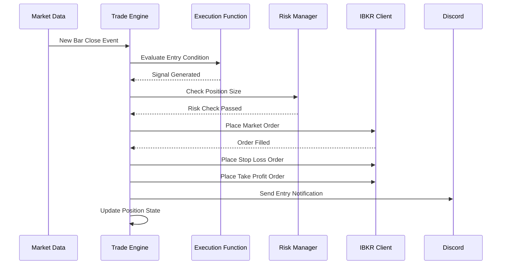
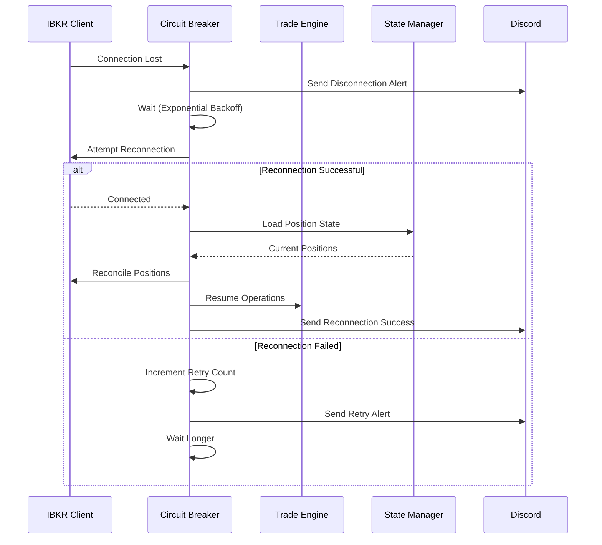
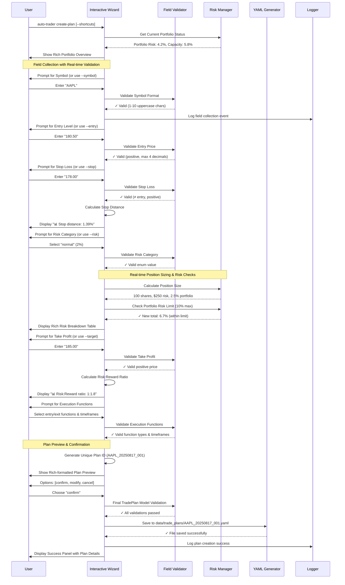
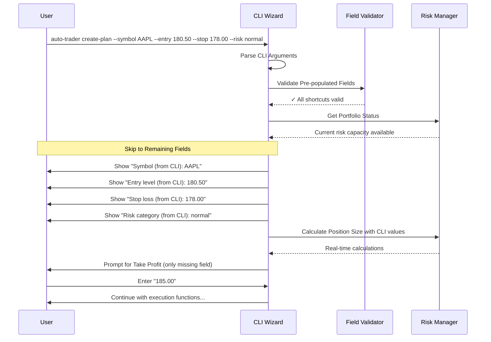

# Core Workflows

## Trade Entry Workflow

```mermaid
sequenceDiagram
    participant Market as Market Data
    participant Engine as Trade Engine  
    participant Func as Execution Function
    participant Risk as Risk Manager
    participant IBKR as IBKR Client
    participant Discord as Discord

    Market->>Engine: New Bar Close Event
    Engine->>Func: Evaluate Entry Condition
    Func-->>Engine: Signal Generated
    Engine->>Risk: Check Position Size
    Risk-->>Engine: Risk Check Passed
    Engine->>IBKR: Place Market Order
    IBKR-->>Engine: Order Filled
    Engine->>IBKR: Place Stop Loss Order
    Engine->>IBKR: Place Take Profit Order
    Engine->>Discord: Send Entry Notification
    Engine->>Engine: Update Position State
```

## Connection Recovery Workflow

```mermaid
sequenceDiagram
    participant IBKR as IBKR Client
    participant CB as Circuit Breaker
    participant Engine as Trade Engine
    participant State as State Manager
    participant Discord as Discord

    IBKR->>CB: Connection Lost
    CB->>Discord: Send Disconnection Alert
    CB->>CB: Wait (Exponential Backoff)
    CB->>IBKR: Attempt Reconnection
    alt Reconnection Successful
        IBKR-->>CB: Connected
        CB->>State: Load Position State
        State-->>CB: Current Positions
        CB->>IBKR: Reconcile Positions
        CB->>Engine: Resume Operations
        CB->>Discord: Send Reconnection Success
    else Reconnection Failed
        CB->>CB: Increment Retry Count
        CB->>Discord: Send Retry Alert
        CB->>CB: Wait Longer
    end
```

## Interactive CLI Wizard Workflow

```mermaid
sequenceDiagram
    participant User as User
    participant CLI as Interactive Wizard
    participant Validator as Field Validator
    participant Risk as Risk Manager
    participant YAML as YAML Generator
    participant Log as Logger

    User->>CLI: auto-trader create-plan [--shortcuts]
    CLI->>Risk: Get Current Portfolio Status
    Risk-->>CLI: Portfolio Risk: 4.2%, Capacity: 5.8%
    CLI->>User: Show Rich Portfolio Overview
    
    Note over CLI,User: Field Collection with Real-time Validation
    CLI->>User: Prompt for Symbol (or use --symbol)
    User->>CLI: Enter "AAPL"
    CLI->>Validator: Validate Symbol Format
    Validator-->>CLI: ✓ Valid (1-10 uppercase chars)
    CLI->>Log: Log field collection event
    
    CLI->>User: Prompt for Entry Level (or use --entry)
    User->>CLI: Enter "180.50"
    CLI->>Validator: Validate Entry Price
    Validator-->>CLI: ✓ Valid (positive, max 4 decimals)
    
    CLI->>User: Prompt for Stop Loss (or use --stop)
    User->>CLI: Enter "178.00"
    CLI->>Validator: Validate Stop Loss
    Validator-->>CLI: ✓ Valid (≠ entry, positive)
    CLI->>CLI: Calculate Stop Distance
    CLI->>User: Display "📊 Stop distance: 1.39%"
    
    CLI->>User: Prompt for Risk Category (or use --risk)
    User->>CLI: Select "normal" (2%)
    CLI->>Validator: Validate Risk Category
    Validator-->>CLI: ✓ Valid enum value
    
    Note over CLI,Risk: Real-time Position Sizing & Risk Checks
    CLI->>Risk: Calculate Position Size
    Risk-->>CLI: 100 shares, $250 risk, 2.5% portfolio
    CLI->>Risk: Check Portfolio Risk Limit (10% max)
    Risk-->>CLI: ✓ New total: 6.7% (within limit)
    CLI->>User: Display Rich Risk Breakdown Table
    
    CLI->>User: Prompt for Take Profit (or use --target)
    User->>CLI: Enter "185.00"
    CLI->>Validator: Validate Take Profit
    Validator-->>CLI: ✓ Valid positive price
    CLI->>CLI: Calculate Risk:Reward Ratio
    CLI->>User: Display "📊 Risk:Reward ratio: 1:1.8"
    
    CLI->>User: Prompt for Execution Functions
    User->>CLI: Select entry/exit functions & timeframes
    CLI->>Validator: Validate Execution Functions
    Validator-->>CLI: ✓ Valid function types & timeframes
    
    Note over CLI,User: Plan Preview & Confirmation
    CLI->>CLI: Generate Unique Plan ID (AAPL_20250817_001)
    CLI->>User: Show Rich-formatted Plan Preview
    CLI->>User: Options: [confirm, modify, cancel]
    User->>CLI: Choose "confirm"
    
    CLI->>Validator: Final TradePlan Model Validation
    Validator-->>CLI: ✓ All validations passed
    CLI->>YAML: Save to data/trade_plans/AAPL_20250817_001.yaml
    YAML-->>CLI: ✓ File saved successfully
    CLI->>Log: Log plan creation success
    CLI->>User: Display Success Panel with Plan Details
```

## CLI Plan Creation with Shortcuts

```mermaid
sequenceDiagram
    participant User as User
    participant CLI as CLI Wizard
    participant Validator as Field Validator
    participant Risk as Risk Manager

    User->>CLI: auto-trader create-plan --symbol AAPL --entry 180.50 --stop 178.00 --risk normal
    CLI->>CLI: Parse CLI Arguments
    CLI->>Validator: Validate Pre-populated Fields
    Validator-->>CLI: ✓ All shortcuts valid
    CLI->>Risk: Get Portfolio Status
    Risk-->>CLI: Current risk capacity available
    
    Note over CLI,User: Skip to Remaining Fields
    CLI->>User: Show "Symbol (from CLI): AAPL"
    CLI->>User: Show "Entry level (from CLI): 180.50"
    CLI->>User: Show "Stop loss (from CLI): 178.00"
    CLI->>User: Show "Risk category (from CLI): normal"
    
    CLI->>Risk: Calculate Position Size with CLI values
    Risk-->>CLI: Real-time calculations
    CLI->>User: Prompt for Take Profit (only missing field)
    User->>CLI: Enter "185.00"
    CLI->>User: Continue with execution functions...
```
