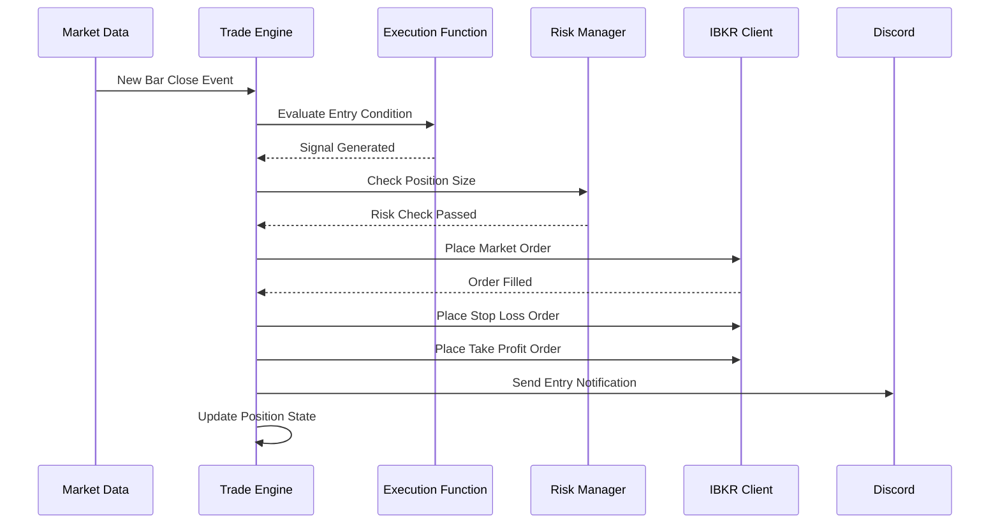
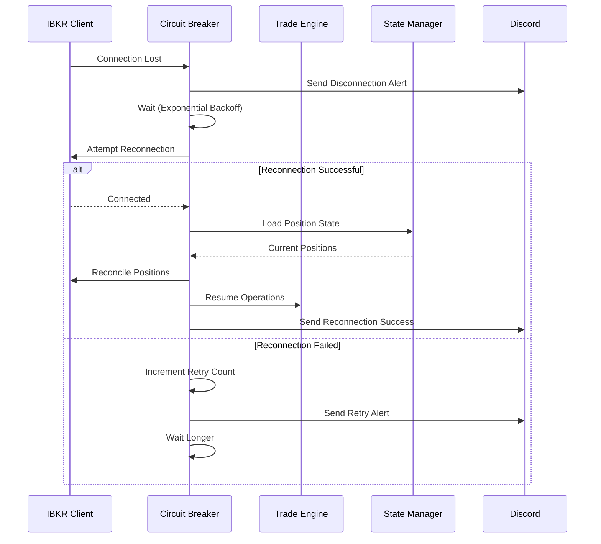
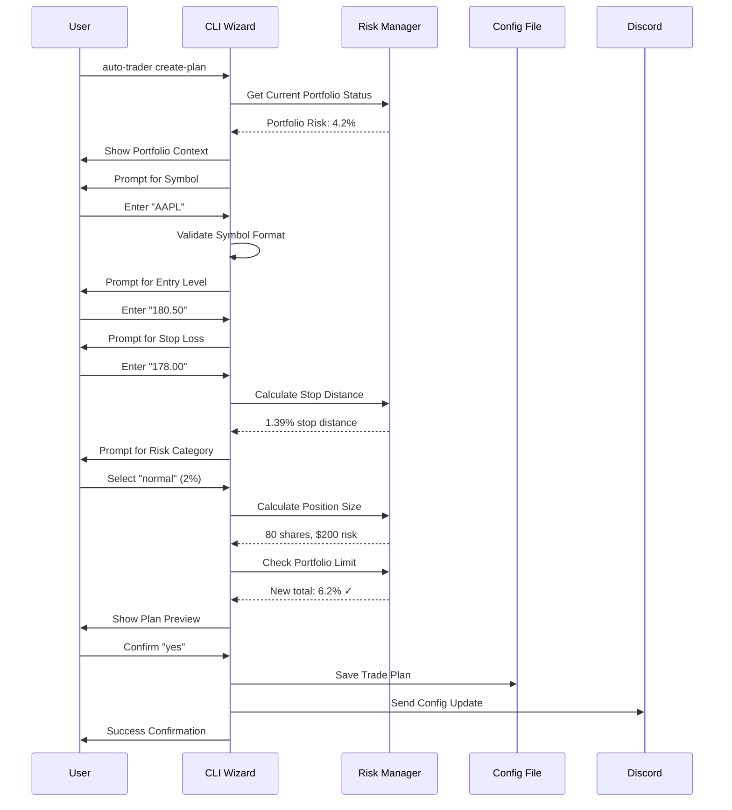

# Core Workflows

## Trade Entry Workflow

```mermaid
sequenceDiagram
    participant Market as Market Data
    participant Engine as Trade Engine  
    participant Func as Execution Function
    participant Risk as Risk Manager
    participant IBKR as IBKR Client
    participant Discord as Discord

    Market->>Engine: New Bar Close Event
    Engine->>Func: Evaluate Entry Condition
    Func-->>Engine: Signal Generated
    Engine->>Risk: Check Position Size
    Risk-->>Engine: Risk Check Passed
    Engine->>IBKR: Place Market Order
    IBKR-->>Engine: Order Filled
    Engine->>IBKR: Place Stop Loss Order
    Engine->>IBKR: Place Take Profit Order
    Engine->>Discord: Send Entry Notification
    Engine->>Engine: Update Position State
```

## Connection Recovery Workflow

```mermaid
sequenceDiagram
    participant IBKR as IBKR Client
    participant CB as Circuit Breaker
    participant Engine as Trade Engine
    participant State as State Manager
    participant Discord as Discord

    IBKR->>CB: Connection Lost
    CB->>Discord: Send Disconnection Alert
    CB->>CB: Wait (Exponential Backoff)
    CB->>IBKR: Attempt Reconnection
    alt Reconnection Successful
        IBKR-->>CB: Connected
        CB->>State: Load Position State
        State-->>CB: Current Positions
        CB->>IBKR: Reconcile Positions
        CB->>Engine: Resume Operations
        CB->>Discord: Send Reconnection Success
    else Reconnection Failed
        CB->>CB: Increment Retry Count
        CB->>Discord: Send Retry Alert
        CB->>CB: Wait Longer
    end
```

## CLI Trade Plan Creation Workflow

```mermaid
sequenceDiagram
    participant User as User
    participant CLI as CLI Wizard
    participant Risk as Risk Manager
    participant YAML as Config File
    participant Discord as Discord

    User->>CLI: auto-trader create-plan
    CLI->>Risk: Get Current Portfolio Status
    Risk-->>CLI: Portfolio Risk: 4.2%
    CLI->>User: Show Portfolio Context
    
    CLI->>User: Prompt for Symbol
    User->>CLI: Enter "AAPL"
    CLI->>CLI: Validate Symbol Format
    CLI->>User: Prompt for Entry Level
    User->>CLI: Enter "180.50"
    
    CLI->>User: Prompt for Stop Loss
    User->>CLI: Enter "178.00"
    CLI->>Risk: Calculate Stop Distance
    Risk-->>CLI: 1.39% stop distance
    
    CLI->>User: Prompt for Risk Category
    User->>CLI: Select "normal" (2%)
    CLI->>Risk: Calculate Position Size
    Risk-->>CLI: 80 shares, $200 risk
    CLI->>Risk: Check Portfolio Limit
    Risk-->>CLI: New total: 6.2% ✓
    
    CLI->>User: Show Plan Preview
    User->>CLI: Confirm "yes"
    CLI->>YAML: Save Trade Plan
    CLI->>Discord: Send Config Update
    CLI->>User: Success Confirmation
```
