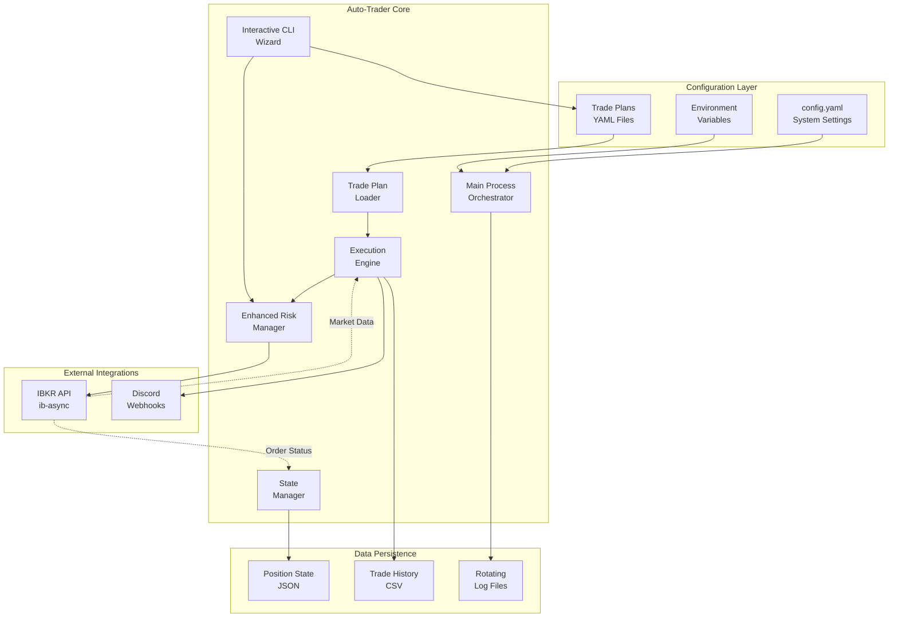

# High Level Architecture

## Technical Summary

Auto-Trader is a monolithic Python application designed for automated trade execution with time-based triggers. The system connects to Interactive Brokers for market data and trade execution, implements risk management checks, and provides observability through Discord notifications. Built following KISS and YAGNI principles, it uses established libraries (ib-async, pandas, pydantic) to minimize custom code and focuses on reliability over complexity.

## High Level Overview

**Architectural Style:** Monolithic application with modular components
- Single Python process managing all functionality  
- Clear module separation following vertical slice architecture
- Shared in-memory state for sub-second execution latency
- File-based persistence for configuration and state

**Repository Structure:** Monorepo (as defined in PRD)
- All components in single repository for simplified deployment
- Vertical slice organization with tests next to code
- Maximum 500 lines per file, functions under 50 lines

**Service Architecture:** Event-driven monolith
- Async event loops for market data processing
- Time-based triggers using APScheduler
- In-memory state management for low latency
- File-based persistence for durability

**Primary Data Flow:**
1. Trade plans loaded from YAML files or created via interactive CLI wizard
2. Position sizing calculated automatically using risk management module  
3. Market data streamed from IBKR WebSocket
4. Execution functions evaluate on candle close events
5. Comprehensive risk checks performed before order placement (portfolio limits, position sizing)
6. Orders submitted to IBKR, notifications sent to Discord with risk metrics
7. Trade history appended to CSV, state persisted to JSON with risk tracking

## High Level Project Diagram

## Architectural and Design Patterns

- **Event-Driven Architecture:** Market data events trigger execution logic - _Rationale:_ Natural fit for real-time trading systems, enables responsive execution
- **Repository Pattern:** Abstract data access for trade plans and state - _Rationale:_ Simplifies testing and future migration to database if needed
- **Strategy Pattern:** Pluggable execution functions (close_above, close_below, trailing_stop) - _Rationale:_ Enables easy addition of new execution logic without modifying core engine
- **Observer Pattern:** WebSocket market data subscriptions with callbacks - _Rationale:_ Decouples data reception from processing logic
- **Circuit Breaker Pattern:** Connection management with automatic reconnection - _Rationale:_ Ensures resilience to network issues
- **Dependency Injection:** Configuration and dependencies passed to constructors - _Rationale:_ Improves testability and follows SOLID principles
