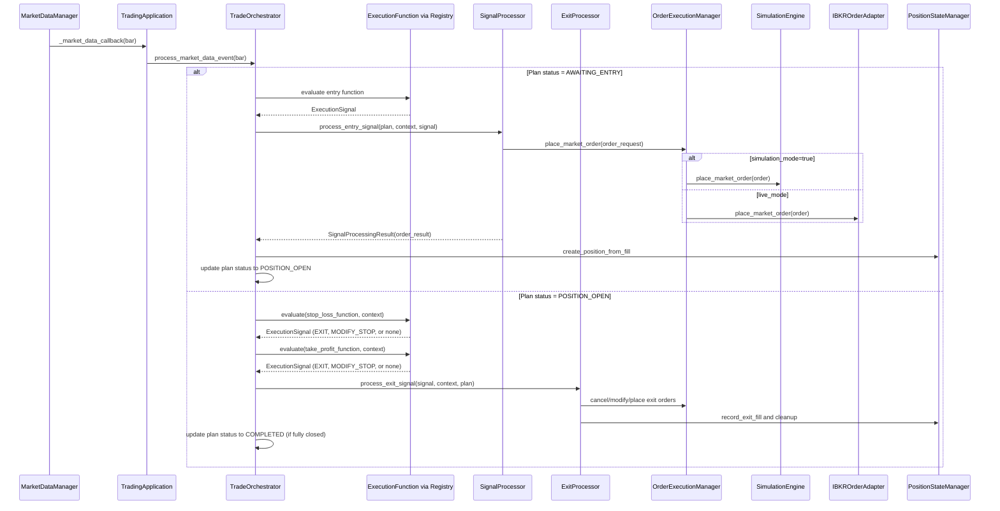

# Runtime Execution Flow (Code-Level)

This document describes the **actual runtime call chain** for trade evaluation and order placement in the current codebase.

> **Mermaid rendering note:** Some Markdown viewers (including many IDE previews) do **not** render Mermaid diagrams and will show the Mermaid text as a code block.
> If that’s what you’re seeing, view this file in a Mermaid-capable renderer (e.g. GitHub), or use the **plain-text fallback** below.

It complements:
- `docs/architecture/core-workflows.md` (conceptual workflows)
- `docs/architecture/execution-function-framework.md` (bar-close driven “execution framework” pipeline)

---

## Primary Runtime Path (Production Startup Wrapper)

When you run the system via `run_auto_trader.py`, the main flow is:

1. **Bootstrap + logging + config validation**
   - `run_auto_trader.py:run_auto_trader()`
   - config is loaded and validated
   - logging is configured early (so validation/startup failures are captured)

2. **Create app + start**
   - `app = AutoTraderApp(settings)`
   - `await app.start()`

3. **App start triggers initialization**
   - `AutoTraderApp.start()`
     - `await self.initialize()`
       - configure logging (again, but handlers are reset by loguru)
       - validate configuration
       - `await self._initialize_trade_engine(...)`
         - creates `TradingApplication(...)`
         - `await self.trading_app.initialize()`
         - `await self.trading_app.start()`
     - `await self._run_main_loop()` (mostly monitors shutdown)

---

## Market Data → Plan Evaluation → Orders (TradeOrchestrator Path)

This is the **main trading loop** for entries/exits in the current runtime.

### High-level sequence

### Plain-text fallback (same flow)

- **Market data ingestion**
  - `MarketDataManager` calls `TradingApplication._market_data_callback(bar)`
  - `TradingApplication` forwards the bar to `TradeOrchestrator.process_market_data_event(bar)`
- **Per plan**
  - If plan status is **AWAITING_ENTRY**
    - evaluate entry function → if signal triggers → `SignalProcessor.process_entry_signal(...)`
    - order placement via `OrderExecutionManager.place_market_order(...)`
      - simulation: `OrderSimulationEngine.place_market_order(...)`
      - live: `IBKROrderAdapter.place_market_order(...)`
    - create position in `PositionStateManager`
    - update plan status to **POSITION_OPEN**
  - If plan status is **POSITION_OPEN**
    - evaluate stop-loss and take-profit functions
    - on EXIT/MODIFY_STOP → `ExitProcessor.process_exit_signal(...)`
    - cancel/modify/place exit orders via `OrderExecutionManager`
    - record fills + cleanup via `PositionStateManager`
    - if fully closed → update plan status to **COMPLETED**

### Concrete code path (where to look)

- **Market data callback into orchestrator**
  - `src/auto_trader/trade_engine/main_application.py`
    - `TradingApplication._market_data_callback()`
    - `TradingApplication.process_market_data()` (alternate entry point)

- **Per-bar evaluation loop**
  - `src/auto_trader/trade_engine/orchestration/core.py`
    - `TradeOrchestrator.process_market_data_event()`
    - `_evaluate_trade_plan()`
    - `_evaluate_entry_function()`
    - `_evaluate_exit_functions()`

- **Entry order placement**
  - `src/auto_trader/trade_engine/signal_processing/core.py`
    - `SignalProcessor.process_entry_signal()`
    - `_process_long_entry()` / `_process_short_entry()`
    - calls `OrderExecutionManager.place_market_order(...)`

- **Exit order placement + cleanup**
  - `src/auto_trader/trade_engine/exit_processor/core.py`
    - `ExitProcessor.process_exit_signal()`
    - `_process_position_exit()` / `_process_stop_modification()`

- **Order routing (simulation vs IBKR)**
  - `src/auto_trader/integrations/ibkr_client/order_execution_manager.py`
    - `OrderExecutionManager.place_market_order()`
    - routes to:
      - `OrderSimulationEngine` (simulation)
      - `IBKROrderAdapter` (live)

---

## “Two Orchestration Paths” (Why It Can Feel Complicated)

There are two different ways execution signals can lead to orders:

### Path A (Orchestrator-driven, current runtime)

- `TradingApplication` subscribes to market data and forwards each bar to:
  - `TradeOrchestrator.process_market_data_event()`
- The orchestrator itself:
  - builds `ExecutionContext`
  - calls `execution_function.evaluate(context)`
  - calls `SignalProcessor` / `ExitProcessor` to place orders and update state

This is the path used by the `TradingApplication` market-data callback today.

### Path B (Execution-framework-driven, used heavily in tests)

- `MarketDataExecutionAdapter` (bar-close detection + historical bars)
  - evaluates functions
  - emits signals via `SignalEmitter`
- `ExecutionOrderAdapter.handle_execution_signal(...)`
  - routes signal actions to `SignalHandler`
  - calls `OrderExecutionManager`

This path is described in more detail in:
- `docs/architecture/execution-function-framework.md`

---

## Logging Note (Why It’s Configured Twice)

Logging is configured both:
- in `run_auto_trader.py` (early bootstrap), and
- in `AutoTraderApp.initialize()` (self-contained app initialization)

This is intentional for robustness:
- the wrapper wants structured logs for **config checks and early failures**
- the app wants to be runnable **without** the wrapper (`python src/main.py`)

The underlying loguru configuration resets handlers (`logger.remove()`), so re-configuring tends to **replace** sinks rather than double-log.

