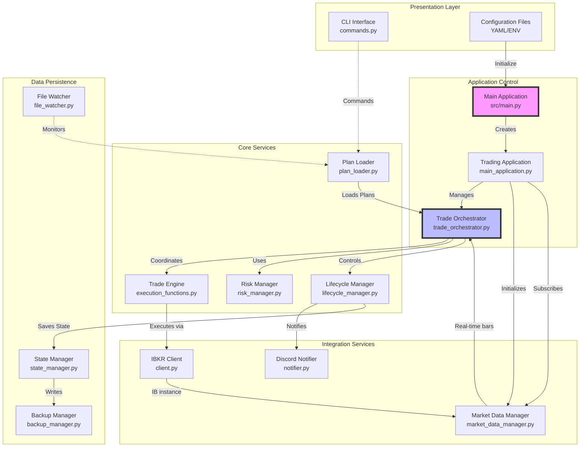
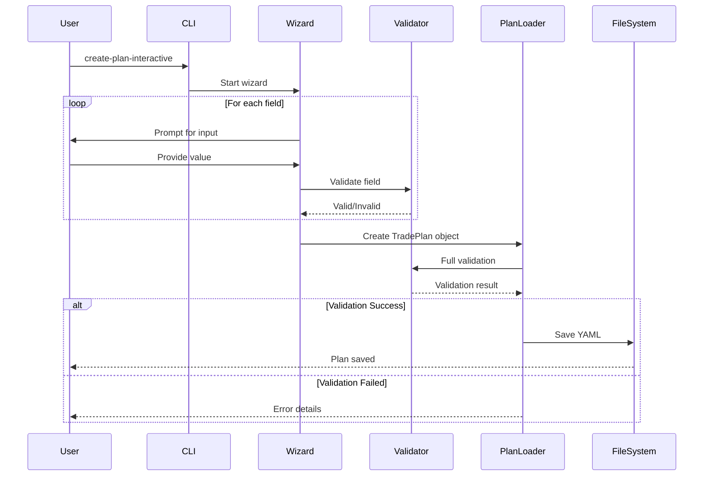
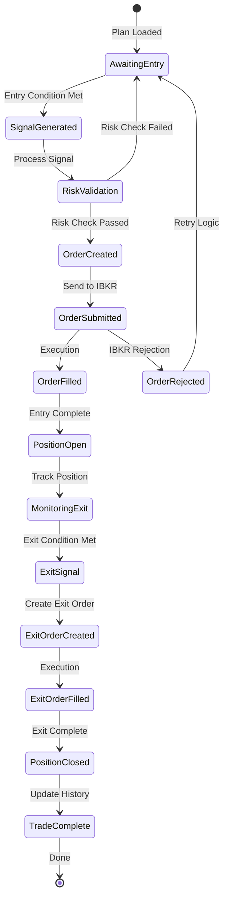
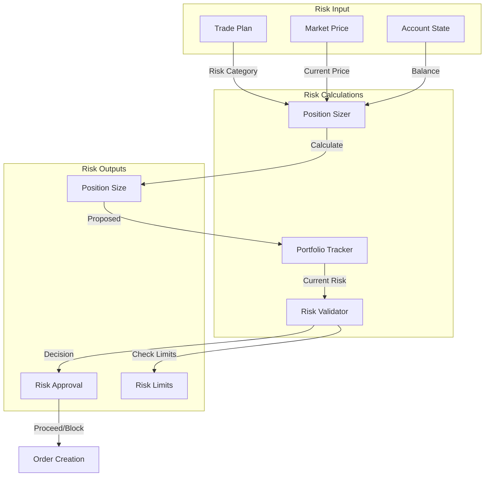
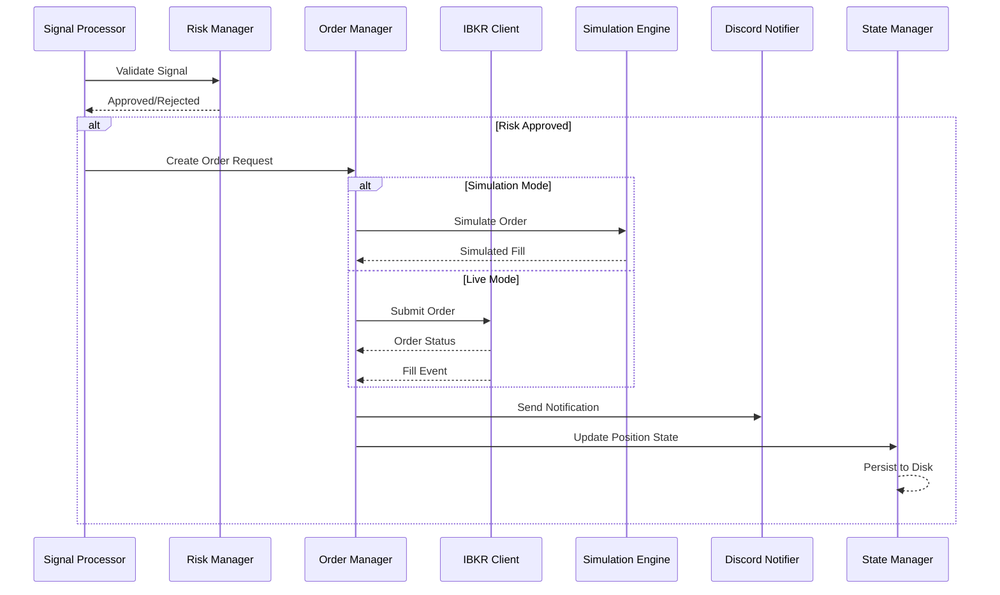
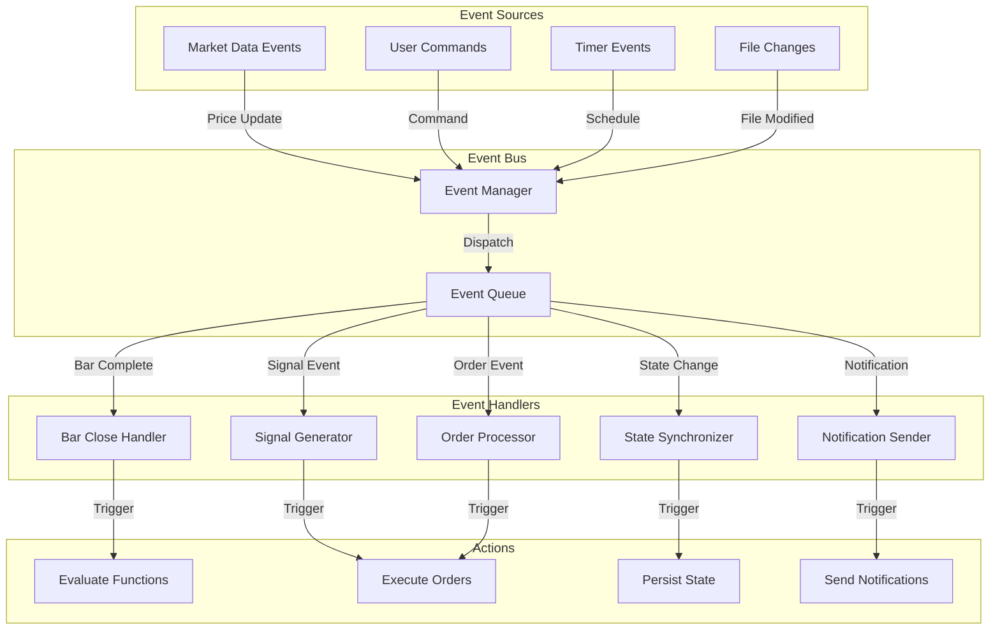
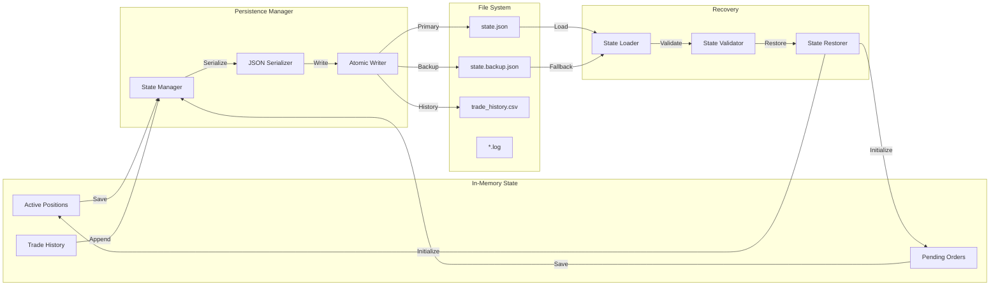
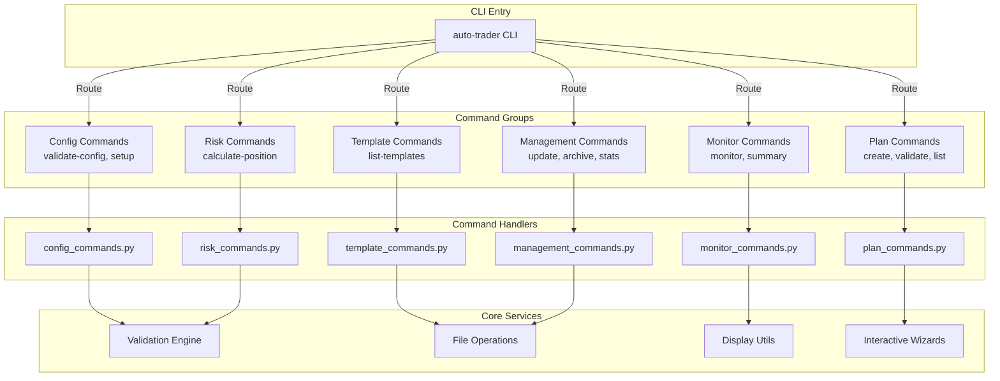
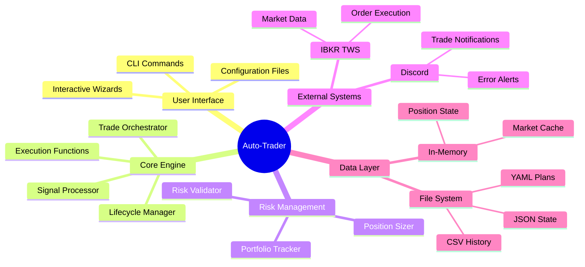
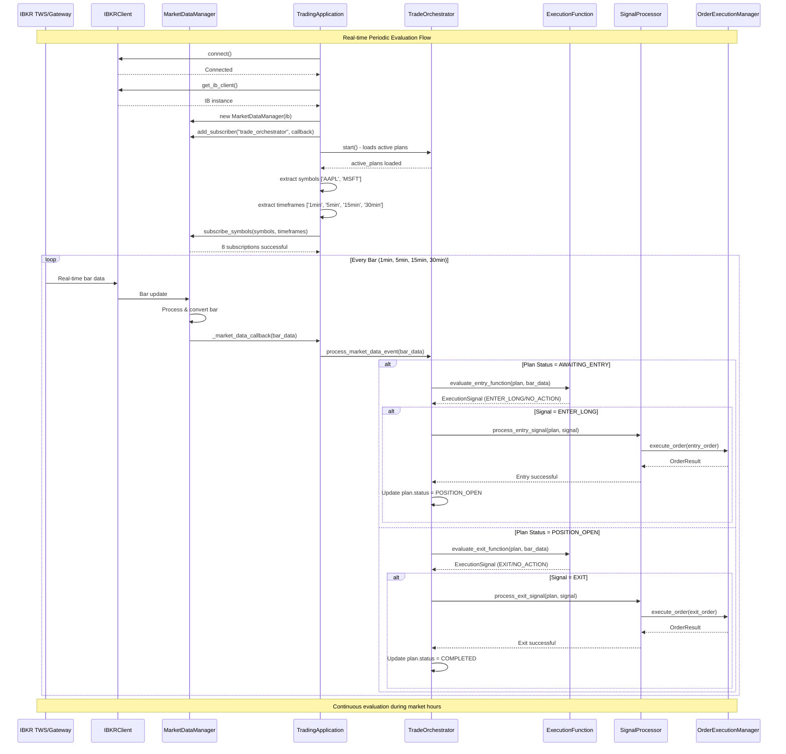

# Component Interaction Diagrams

## System Component Map

This document provides detailed interaction diagrams showing how components communicate within the Auto-Trader system.

## 1. High-Level Component Architecture



## 2. Trade Plan Creation and Validation Flow



## 3. Market Data Pipeline ✅ **FULLY INTEGRATED**

```mermaid
graph LR
    subgraph "IBKR Integration"
        TWS[IBKR TWS/Gateway]
        IBKRClient[IBKR Client<br/>client.py]
        IB_Instance[IB Instance<br/>get_ib_client()]
    end
    
    subgraph "Market Data Management (NEW)"
        MktDataMgr[Market Data Manager<br/>market_data_manager.py]
        SubMgr[Subscription Manager<br/>subscription_manager.py]
        DataDist[Data Distribution<br/>market_data_distribution.py]
        BarConv[Bar Converter<br/>bar_converter.py]
    end
    
    subgraph "Application Integration (NEW)"
        TradingApp[Trading Application<br/>main_application.py]
        Callback[Market Data Callback<br/>_market_data_callback()]
        TradeOrch[Trade Orchestrator<br/>trade_orchestrator.py]
    end
    
    subgraph "Signal Processing"
        BarData[Bar Data Events]
        ExecFunc[Execution Functions<br/>close_above/below/trailing]
        SignalProc[Signal Processor<br/>signal_processor.py]
    end
    
    subgraph "Plan Analysis (NEW)"
        PlanLoader[Active Trade Plans]
        SymbolExtract[Symbol Extraction<br/>['AAPL', 'MSFT']]
        TimeframeExtract[Timeframe Extraction<br/>['1min', '5min', '15min', '30min']]
    end
    
    TWS -->|Real-time Data| IBKRClient
    IBKRClient -->|Exposes| IB_Instance
    IB_Instance -->|Connects| MktDataMgr
    
    TradingApp -->|Initializes| MktDataMgr
    TradingApp -->|Registers Callback| MktDataMgr
    
    PlanLoader -->|Active Plans| TradingApp
    TradingApp -->|Extract| SymbolExtract
    TradingApp -->|Extract| TimeframeExtract
    SymbolExtract -->|Subscribe| SubMgr
    TimeframeExtract -->|Subscribe| SubMgr
    
    MktDataMgr -->|Manages| SubMgr
    SubMgr -->|Real-time Bars| BarConv
    BarConv -->|Processed| DataDist
    DataDist -->|Distribute| Callback
    Callback -->|Route| TradeOrch
    
    TradeOrch -->|Process| BarData
    BarData -->|Evaluate| ExecFunc
    ExecFunc -->|Generate| SignalProc
    
    style MktDataMgr fill:#f9f,stroke:#333,stroke-width:3px
    style TradingApp fill:#bbf,stroke:#333,stroke-width:3px
    style Callback fill:#bfb,stroke:#333,stroke-width:3px
```

## 4. Trade Execution Lifecycle



## 5. Risk Management Integration



## 6. Order Management Flow



## 7. Event-Driven Architecture



## 8. Data Persistence Layer



## 9. CLI Command Router



## 10. Integration Points Summary



## 11. Periodic Signal Evaluation Flow ✅ **NEW IMPLEMENTATION**



**Key Implementation Details:**

1. **Automatic Symbol Detection**: Extracts unique symbols from all active trade plans
2. **Dynamic Timeframe Subscription**: Subscribes to all timeframes used by entry/exit functions
3. **Real-time Bar Processing**: Each bar update triggers evaluation for relevant plans
4. **Status-Based Evaluation**: Entry functions for AWAITING_ENTRY, exit functions for POSITION_OPEN
5. **Complete Lifecycle**: Automatic transition from entry → position tracking → exit → completion

## Component Communication Patterns

### 1. **Request-Response**
- CLI → Command Handlers
- Risk Manager → Position Sizer
- Order Manager → IBKR Client

### 2. **Event-Driven** ✅ **NOW FULLY FUNCTIONAL**
- **Market Data → Bar Close Events** ✅ Real-time IBKR integration complete
- **Bar Events → Signal Evaluation** ✅ Automatic periodic evaluation
- **Order Events → Discord Notifications** ✅ Complete trade lifecycle notifications
- File Changes → Plan Reloading (planned for v2)

### 3. **Publish-Subscribe** ✅ **ENHANCED WITH REAL-TIME DATA**
- **Market Data Distribution** ✅ MarketDataManager → TradeOrchestrator subscription
- **Real-time Bar Streaming** ✅ Automatic distribution to all registered subscribers
- Signal Broadcasting ✅ Signal events distributed to order processors
- State Change Notifications ✅ Position state changes broadcasted

### 4. **Pipeline**
- Market Data → Processing → Caching
- Signal → Validation → Execution
- Trade → History → Persistence

### 5. **Circuit Breaker**
- IBKR Connection Management
- Rate Limiting
- Error Recovery

## Key Integration Considerations

1. **Loose Coupling**: Components communicate through well-defined interfaces
2. **Async Operations**: Non-blocking I/O for market data and external APIs
3. **Error Boundaries**: Each component handles its own errors gracefully
4. **State Consistency**: Atomic operations for state changes
5. **Performance**: Caching and batching for efficiency
6. **Observability**: Comprehensive logging at all integration points
7. **Testability**: Mock implementations for all external dependencies
8. **Resilience**: Retry logic and fallback mechanisms