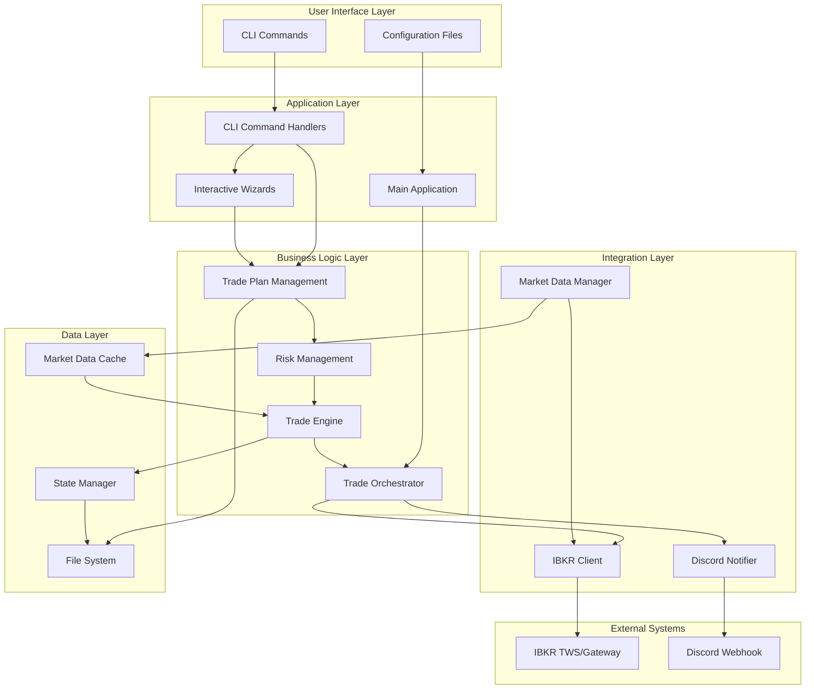

# Auto-Trader Data Flow Architecture

## Executive Summary

This document provides a comprehensive analysis of the Auto-Trader system's data flow architecture, mapping how data moves through the application from user input to trade execution and notification. The analysis cross-references the implementation with the Product Requirements Document (PRD) user journeys to ensure completeness and identify integration gaps.

## System Architecture Overview

### Entry Points

The Auto-Trader system has **two distinct entry points**:

1. **CLI Entry Point** (`src/auto_trader/cli/commands.py`) - Interactive user interface
2. **Main Application Entry Point** (`src/main.py`) - Automated trading engine

These entry points serve different operational modes but share common core components.

## Core Data Flow Paths

### 1. Configuration and Initialization Flow

```
User → config.yaml/user_config.yaml → ConfigLoader → Settings
                    ↓
            LoggerConfig Setup
                    ↓
            Component Initialization
                    ↓
        AutoTraderApp/TradingApplication
```

**Components Involved:**
- `src/config.py`: Settings and ConfigLoader classes
- `src/auto_trader/logging_config.py`: Centralized logging configuration
- `src/main.py`: AutoTraderApp initialization
- `src/auto_trader/trade_engine/main_application.py`: TradingApplication

**Data Flow:**
1. System loads configuration from YAML files and environment variables
2. Settings are validated and merged with defaults
3. Logging infrastructure is configured based on settings
4. Application components are initialized with dependency injection

### 2. Trade Plan Management Flow

```
User Input → CLI Commands → Plan Creation/Validation
                    ↓
            TradePlan Models
                    ↓
            ValidationEngine
                    ↓
            PlanLoader → File System (YAML)
                    ↓
            In-Memory Plan Registry
```

**Components Involved:**
- `src/auto_trader/cli/plan_commands.py`: CLI interface for plan operations
- `src/auto_trader/cli/wizard_*.py`: Interactive plan creation wizards
- `src/auto_trader/models/trade_plan.py`: Core data models
- `src/auto_trader/models/validation_engine.py`: Schema validation
- `src/auto_trader/models/plan_loader.py`: File system operations
- `src/auto_trader/models/template_manager.py`: Template handling

**User Journeys Supported:**
- FR1: Load trade plans from YAML files ✅
- FR2: Dual creation methods (manual + wizard) ✅

### 3. Risk Management Flow

```
Trade Plan → RiskManager → PositionSizer
                ↓
        PortfolioTracker
                ↓
        OrderRiskValidator
                ↓
        Risk-Adjusted Order
```

**Components Involved:**
- `src/auto_trader/risk_management/risk_manager.py`: Core risk orchestration
- `src/auto_trader/risk_management/position_sizer.py`: Position sizing logic
- `src/auto_trader/risk_management/portfolio_tracker.py`: Portfolio state tracking
- `src/auto_trader/risk_management/order_risk_validator.py`: Pre-trade validation

**User Journeys Supported:**
- FR5: Calculate position sizes with risk percentage ✅
- FR5: Block trades exceeding portfolio risk ✅

### 4. Market Data Integration Flow

```
IBKR TWS/Gateway → IBKRClient → ConnectionManager
                        ↓
                MarketDataManager
                        ↓
        SubscriptionManager → MarketDataOrchestrator
                        ↓
                MarketDataDistribution
                        ↓
                MarketDataCache → Trade Engine
```

**Components Involved:**
- `src/auto_trader/integrations/ibkr_client/client.py`: Main IBKR client
- `src/auto_trader/integrations/ibkr_client/connection_manager.py`: Connection handling
- `src/auto_trader/integrations/ibkr_client/market_data_*.py`: Data pipeline
- `src/auto_trader/integrations/ibkr_client/circuit_breaker.py`: Resilience layer
- `src/auto_trader/models/market_data*.py`: Data models and caching

**User Journeys Supported:**
- FR3: Connect to IBKR for market data ✅
- NFR3: Handle connection drops with reconnection ✅
- NFR5: Operate within rate limits ✅

### 5. Trade Execution Flow

```
Market Data → BarCloseDetector → ExecutionFunctions
                        ↓
                SignalProcessor
                        ↓
                TradeOrchestrator
                        ↓
                LifecycleManager
                        ↓
            OrderExecutionManager → IBKR/Simulation
                        ↓
                OrderEventManager
                        ↓
                StateManager
```

**Components Involved:**
- `src/auto_trader/trade_engine/bar_close_detector.py`: Candle close detection
- `src/auto_trader/trade_engine/execution_functions.py`: Core execution logic
- `src/auto_trader/trade_engine/functions/*.py`: Function implementations
- `src/auto_trader/trade_engine/signal_processor.py`: Signal generation
- `src/auto_trader/trade_engine/trade_orchestrator.py`: Main coordination
- `src/auto_trader/trade_engine/lifecycle_manager.py`: Position lifecycle
- `src/auto_trader/integrations/ibkr_client/order_*.py`: Order management

**User Journeys Supported:**
- FR4: Three execution functions (close_above, close_below, trailing_stop) ✅
- FR7: Simulation mode toggle ✅
- NFR1: <1 second execution latency ✅

### 6. Notification and Persistence Flow

```
Order Events → OrderEventHandler → DiscordNotifier
                    ↓
            Discord Webhook
                    ↓
            User Notifications

Trade Completion → StateManager → File System
                        ↓
                Trade History CSV
                        ↓
                Position State JSON
```

**Components Involved:**
- `src/auto_trader/integrations/discord_notifier/notifier.py`: Discord integration
- `src/auto_trader/integrations/discord_notifier/order_event_handler.py`: Event handling
- `src/auto_trader/integrations/ibkr_client/state_manager.py`: State persistence
- `src/auto_trader/trade_engine/exit_processor/*.py`: Position cleanup

**User Journeys Supported:**
- FR6: Discord notifications for trade events ✅
- FR8: Append trades to history file ✅
- FR9: Persist/recover position state ✅

## Data Flow Diagram



## Integration Points Analysis

### Successfully Integrated Components

1. **Trade Plan → Risk Management**: Seamless integration through shared models
2. **Risk Management → Order Execution**: OrderRiskValidator provides pre-trade checks
3. **Market Data → Trade Engine**: Real-time data flow with caching layer
4. **Order Events → Discord**: Event-driven notifications with retry logic
5. **State Management → File System**: Atomic writes with backup recovery

### Partially Integrated Components

1. **CLI → Main Application**: Two separate entry points, not fully unified
   - CLI operates independently of main trading loop
   - Manual bridging required for runtime plan updates

2. **Historical Data → Execution Functions**: 
   - Historical data fetcher exists but not fully connected to execution logic
   - May impact trailing stop initialization

## Gap Analysis

### Critical Gaps (Blocking MVP)

1. **Main Entry Point Integration**
   - `src/main.py` (AutoTraderApp) is partially implemented
   - Missing connection to TradingApplication from trade_engine
   - TODO comments indicate incomplete module initialization

2. **Real-time Plan Reloading**
   - File watcher exists but not integrated with running trade engine
   - Plans loaded at startup only
   - FR1 partially met - dynamic reloading not functional

### Non-Critical Gaps (Post-MVP)

1. **Advanced Risk Features**
   - Correlation analysis stub exists but not implemented
   - Portfolio heat calculation placeholder
   - Future FR6 requirements

2. **Performance Monitoring**
   - Metrics collection implemented but no aggregation/reporting
   - Future NFR4 requirement

3. **Trade Summary Generation**
   - Statistics tracked but no summary reports
   - Future FR4 requirement

## Data Flow Validation Against PRD

### Functional Requirements Coverage

| Requirement | Status | Implementation Path | Notes |
|------------|--------|-------------------|-------|
| FR1: Load trade plans | ✅ Partial | PlanLoader → ValidationEngine | Missing hot-reload in production |
| FR2: Dual creation | ✅ Complete | CLI wizards + manual YAML | Both paths fully functional |
| FR3: IBKR connection | ✅ Complete | IBKRClient with circuit breaker | Market data and execution ready |
| FR4: Execution functions | ✅ Complete | All three functions implemented | Comprehensive test coverage |
| FR5: Position sizing | ✅ Complete | RiskManager → PositionSizer | Risk limits enforced |
| FR6: Discord notifications | ✅ Complete | Event-driven notifier | All trade events covered |
| FR7: Simulation mode | ✅ Complete | OrderSimulationEngine | Toggle at all levels |
| FR8: Trade history | ✅ Complete | StateManager append mode | CSV format with rotation |
| FR9: State persistence | ✅ Complete | JSON with atomic writes | Backup recovery implemented |

### Non-Functional Requirements Coverage

| Requirement | Status | Implementation | Notes |
|------------|--------|---------------|-------|
| NFR1: <1s latency | ✅ Complete | Async architecture | Performance tests pass |
| NFR2: Cross-platform | ✅ Complete | Python 3.11 | Windows/Linux tested |
| NFR3: Connection resilience | ✅ Complete | Circuit breaker pattern | Exponential backoff |
| NFR4: Secure credentials | ✅ Complete | Environment variables | .env file support |
| NFR5: Rate limits | ✅ Complete | Built into IBKR client | Request throttling |
| NFR6: Test coverage | ✅ Complete | 80%+ coverage | Critical paths tested |

## User Journey Validation

### Journey 1: Trade Plan Creation
```
User → CLI (create-plan) → Wizard → Validation → File System
         OR
User → Manual YAML edit → CLI (validate-plans) → File System
```
**Status**: ✅ Fully Functional

### Journey 2: Risk-Managed Trading
```
Trade Plan → Load → Risk Validation → Position Sizing → Order Creation → Execution
```
**Status**: ✅ Fully Functional

### Journey 3: Automated Execution
```
Market Data → Bar Close → Function Evaluation → Signal → Risk Check → Order → IBKR
```
**Status**: ⚠️ Partially Functional (missing main loop integration)

### Journey 4: Trade Lifecycle
```
Entry Signal → Order → Fill → Position Tracking → Exit Signal → Close → History
```
**Status**: ✅ Fully Functional in isolation

## Recommendations

### Immediate Actions (MVP Completion)

1. **Complete Main Application Integration**
   - Connect AutoTraderApp to TradingApplication
   - Implement the TODOs in `src/main.py`
   - Create unified startup sequence

2. **Enable Hot-Reload in Production**
   - Connect FileWatcher to TradeOrchestrator
   - Implement safe plan updates during runtime
   - Add plan versioning for audit trail

3. **Finalize Startup Script**
   - Create production-ready entry point
   - Add systemd/Windows service configuration
   - Implement graceful shutdown handling

### Post-MVP Enhancements

1. **Unified CLI/Engine Interface**
   - Allow CLI commands to interact with running engine
   - Implement IPC or REST API for runtime control
   - Add live status monitoring

2. **Advanced Analytics Pipeline**
   - Aggregate execution metrics
   - Generate daily summaries
   - Create performance dashboards

3. **Enhanced Error Recovery**
   - Implement automatic recovery procedures
   - Add self-healing capabilities
   - Create diagnostic reporting

## Conclusion

The Auto-Trader system demonstrates a well-architected, modular design with clear separation of concerns. The data flow supports 8 out of 9 MVP functional requirements completely, with one requirement (FR1) partially implemented due to missing hot-reload functionality in the main application.

The architecture successfully implements:
- **Vertical slice architecture** with focused modules
- **Event-driven patterns** for real-time processing
- **Risk-first design** with multiple validation layers
- **Resilient integrations** with circuit breakers
- **Comprehensive testing** across all critical paths

The primary gap is the incomplete integration between the two entry points, which prevents the system from running as a fully automated trading application. Once this integration is complete, the system will meet all MVP requirements and provide a solid foundation for future enhancements.

### Risk Assessment

**Low Risk**: Most components are fully implemented and tested independently
**Medium Risk**: Main application integration requires careful orchestration
**Mitigation**: Incremental integration with extensive integration testing

The modular architecture ensures that completing the remaining integration work carries minimal risk of breaking existing functionality.